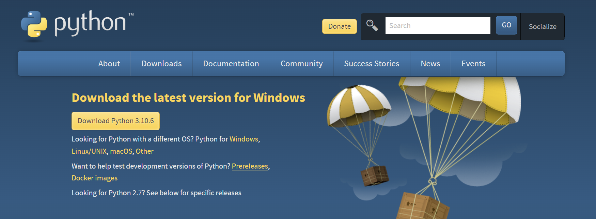
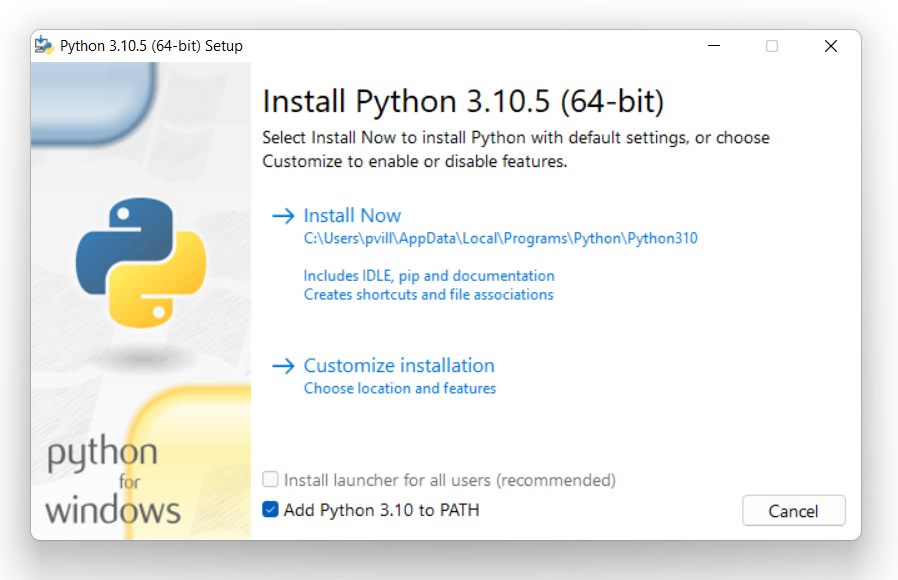
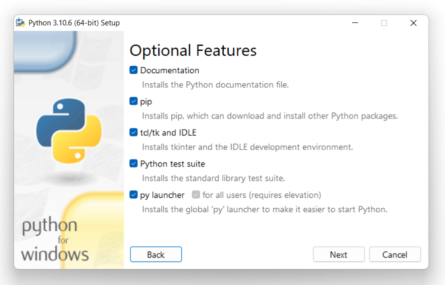
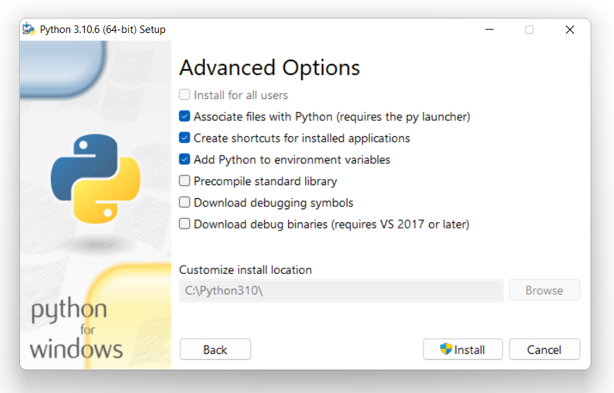
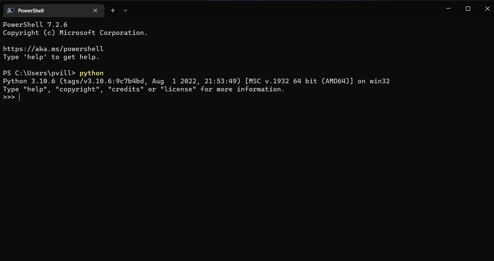
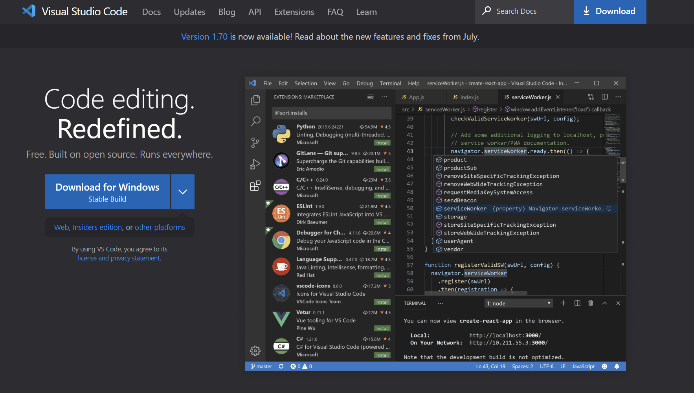
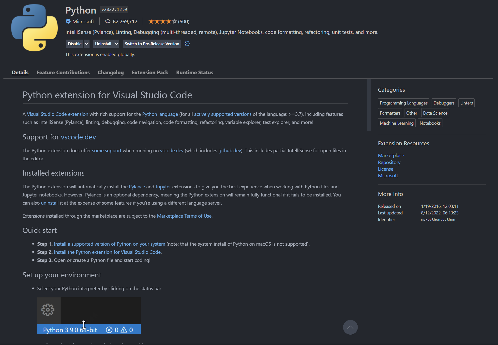
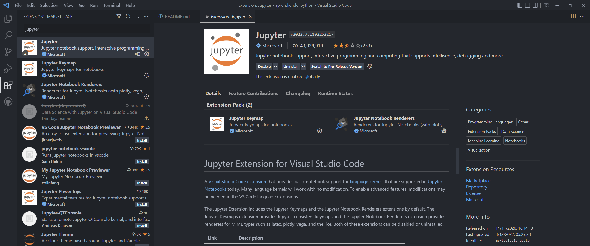
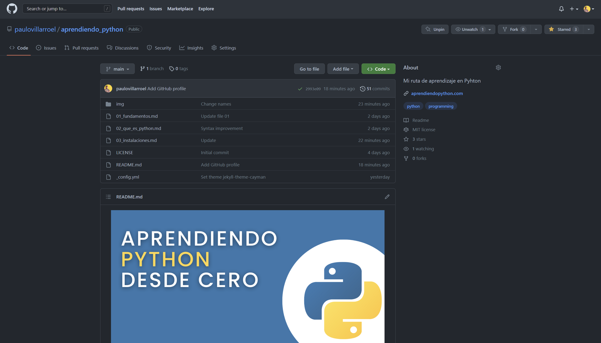

# Instalaciones de programas

Ya que hemos estado hablando de varias cosas sobre programación, ahora es necesario que veamos las cosas que hay que instalar y configurar.

No solo me refiero a instalar Python, que es lo más obvio no?, sino que otras aplicaciones que son de real utilidad para cualquiera que desee empezar en la programación y ser más eficiente.

Acá me voy a referir al uso de Windows como sistema operativo, que es lo que tengo. Las instalaciones en Linux y OSX (Apple) tienen sus particularidades, pero que no conozco en detalle.


## Instalando Python

Para instalar Python, hay que ir a su web oficial https://www.python.org/ 

En la portada de la web, hay que ir a la sección **Downloads**. Se mostrará una serie de links para descargarlo, pero elige la que te pone por defecto (la que aparece en el rectángulo amarillo), que es la última versión disponibe para el sistema operativo desde dond estás ingresando.



En el wizard de instalación hay que tener ojo con un par de cosas:

- Marcar la opción de agregar Pyhton al PATH
- Elegir la opción de instalación CUSTOM
- La ruta donde lo instales cámbiala. Es mejor poner una carpeta directamente en la raíz (en mi caso es disco local "C").

Esta es la que me sale por defecto C:\Users\pvill\AppData\Local\Programs\Python\Python310  

Es mejor poner esta C:\Python310



- En la pantalla donde pide seleccionar instalar documentation, IDLE, pip y todas esas cosas...





Después las otras cosas que salen dejarlas por defecto, darle a SI a los permisos de administrador y darle a siguiente e instalar.

Luego que se termine todo el proceso, ya deberías tener Python instalado en tu computador.


### ¿Cómo saber si ya tengo Python instalado correctamente?

Para saber eso, necesitamos usar la consola de Windows o PowerShell. También se llama "Símbolo del sistema". Igula luego instalaemos una versión más linda y funcional de esta consola. por ahora usa la que tienen nada más. En Windows 11 ya viene instaado por defecto PowerShell, en las versiones anteriores no viene y está la versión más clásica el terminal. 

Escribe en el buscador de programas cmd o símbolo de sistema o terminal o PowerShell. Igual cualquiera sirve por ahora.

Para saber si ya está funcional Pyhton, hay que escribir en la consola "python" (sin las comillas). Si muestra la versión de Python, está todo bien.



Felicitaciones!!!! 🥳

Ya tenemos instalado Python.

Además, fíjate que en la consola aparacen >>> al inicio. Esto indica que estamos dentro de Python y que podemos usarlo desde la misma consola.
Podríamos sumar 3 + 3 y obtener el resultado en la misma consola.
```
>>> 3+3
6
>>>
```

Podríamos imprimir en pantalla el clásico Hola Mundo:
```
>>> print("Hola Mundo")
Hola Mundo
>>>
```

Usar Python desde la consola no es muy buena idea, es poco funcional, no es muy estético y cuesta usarla si nos estás acostumbrado/a a ella.
Para eso, es mejor usar un programa especialmente hecho para escribir código, que es un editor de texto o IDE. 

Actualmente uso Visual Studio Code, que es de Microsoft y es uno, sino el más, famoso y usado actualmente para programación. 


## Instalando Visual Studio Code

Para instalarlo, hay que ir a su web oficial https://code.visualstudio.com/



Por defecto, cuando cargas la página, te muestra la versión más reciente de VSC y la que corresponde a tu sistema operativo.
Puedes elegir otras versiones, pero no es recomendable. Es mejor dejar la que sale nada más.

Instalarlo es como cualquier programa, solo darle a siguiente muchas veces y esperar un poco.

Una vez ya instalado nuestro IDE (Visual Studio Code), hay que hacer algunas configuraciones pequeñas. Bueno, VSC es muy configurable, tiene cientos de opciones la verdad, pero veremos las más básicas para empezar a programar en Pyhton.


### Configurando VSC

Una de las cosas más interesantes de Visual Studio Code es el uso de las extensiones. Las extensiones son como pequeñas aplicaciones que agregan funcionalidades a VSC. 

Para buscar las extensiones, hay 2 formas:
- Desde la web del marketplace
- Desde la misma aplicación de VSC

Por ahora vamos a usar la versión web. 
Ir a https://marketplace.visualstudio.com/VSCode 

Buscar la extensión de pyhton:


Van a salir muchas extensiones, pero la extensión que recomiendo es la de Microsoft, que es la que sale primero habitualmente.


Darle clic a esa extensión e instalarla. 
Te va a pedir algunos permisos para abrir el VSC. Dale permitir.


Luego de unos segundos, ya debería estar instalado.
Te debería salir una pantalla similar a esta en el Visual Studio Code:



Con eso, ya debería estar todo ok!!


Otra extensión de VSC es la Jupyter Notebook.
Esta extensión es interesante, ya que nos va a permitir usar Jupyter dentro de Visual Studio Code. 

Puedes averiguar más de Jupyter en su web oficial https://jupyter.org/

Este es, básicamente, una forma muy simple de crear un archivo en donde se mezclan pedazos de código con texto e imágenes (Markdown). 

Este es un ejemplo que tienen en su web https://jupyter.org/try-jupyter/retro/notebooks/?path=notebooks/Intro.ipynb con un notebook.
Es parecido a un [Google Colab](https://colab.research.google.com/).

Para instalarlo, es similar a lo que hicimos con la extensión de Python, solo que ahora hay que buscar la de Jupyter (Microsoft).
Pero esta vez,lo haremos directamente desde el Visual Studio Code. Para eso, debes hacer clic en el ícono de la izquierda como una cajita de 4 cuadrados. Poner en el buscador "jupyter" (sin comillas) y hacer clic en el botón instalar. En la imagen no me sale eso, pues yo ya lo tengo instalado. Pero te saldrá algo similar.



Y eso es todo.


## Algunas otras cosas importantes

Hasta este momento ya deberiamos tener instalado correctamente Python y Visual Studio Code con su extensión respectiva.

Pero vamos a usar otras cosas que son importantes, como configurar una cuenta de GitHub y tener instalado GIT.

¿Qué es GIT?
Ya lo veremos pronto...
Por ahora quédate con que es una forma de controlar las versiones de tus archivos.

Veamos algo de GitHub.

¿Qué es GitHub?
Es difícil resumirlo, porque ha crecido mucho en funcionalides durante el último tiempo, pero podemos pensar en GitHub como un Google Drive en donde podemos poner nuestro código y permitir que otras personas puedan colaborar en el desarrollo de tus proyectos.

De hecho, no sé si te habías dado cuenta, pero lo que estás leyendo ahora mismo está en GitHub.

Para usarlo, lo primero es ir a su web oficial en https://github.com/ 


Debes crearte una cuenta, para lo cual debes darle clic al botón SIGN UP.
Luego, ingresar tu email, verificarlo (eso es importante, ya que algunos no lo hacen y no saben por qué no les funciona) y seguir los pasos que se te piden. No es nada del otro mundo. Es como crear una cuenta cualquiera.

Una vez ya tengas creada tu cuenta, se pueden hacer varias cosas.

Lo primero es....

Anda al repositorio (así se llaman en GitHub los espacios en donde están guardados los códigos) de este proyecto en https://github.com/paulovillarroel/aprendiendo_python

Si estas en una computador (creo no haberlo mencionado, pero escribir código desde un teléfono o tablet es algo muy poco recomendable, no lo hagas la verdad), observa la sección de arriba a la derecha, hay una estrellita ⭐. Dale clic y se marcará en amarillo. Esto es como darle like en las redes sociales, pero aquí es de código. O algo así. Eso ayuda a dar visbilidad a este proyecto y a que llegue a más personas. 




Se pueden hacer muchas otras cosas en GitHub, como **clonar** el respositorio que es hacerte una copia completa en tu computador de todo, o un **fork** que es copiarte un repositorio en tu propio GitHub (en la nube). Pero esas cosas las veremos un poco más adelante.


Por ahora, con todo ésto, la verdad, ya estamos más que bien para empezar a tirar las primeras líneas de código en Python.


[**<< VOLVER**](https://github.com/paulovillarroel/aprendiendo_python)