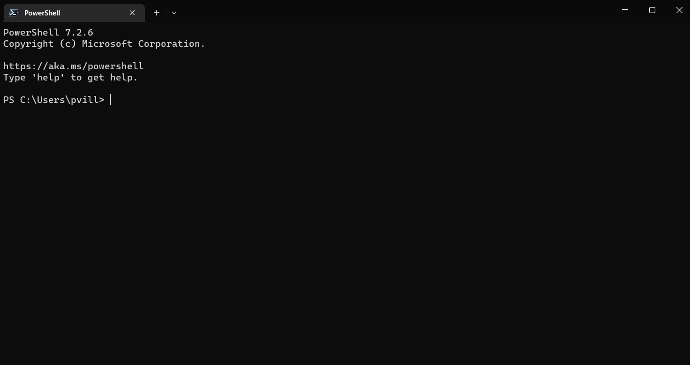
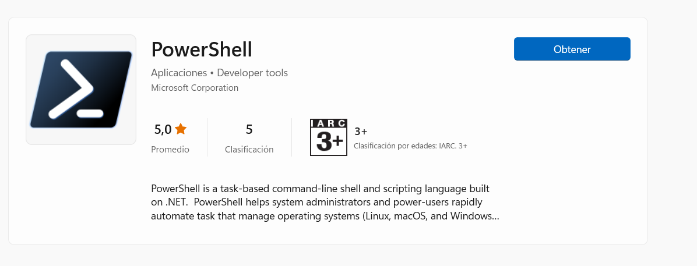
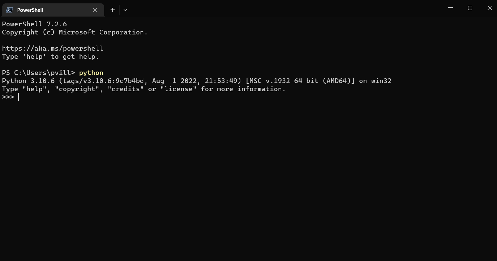
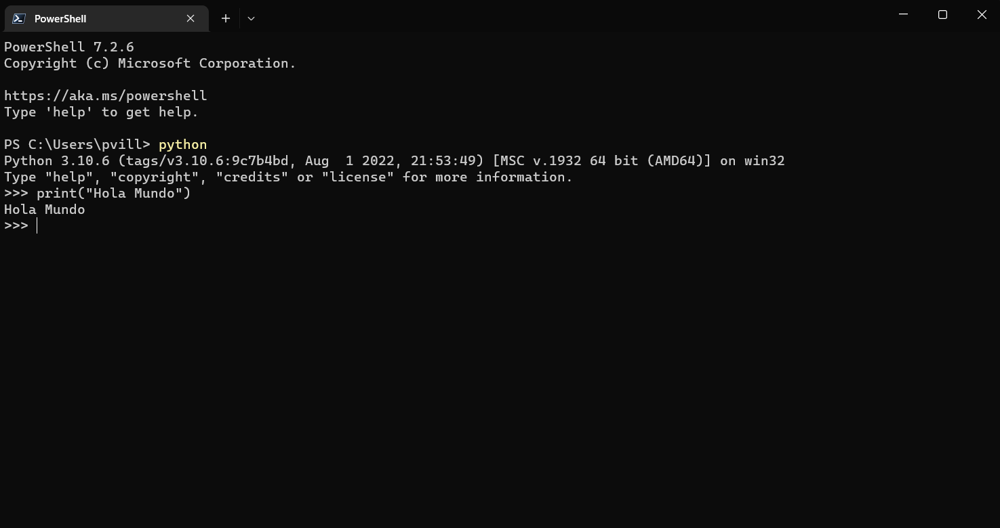
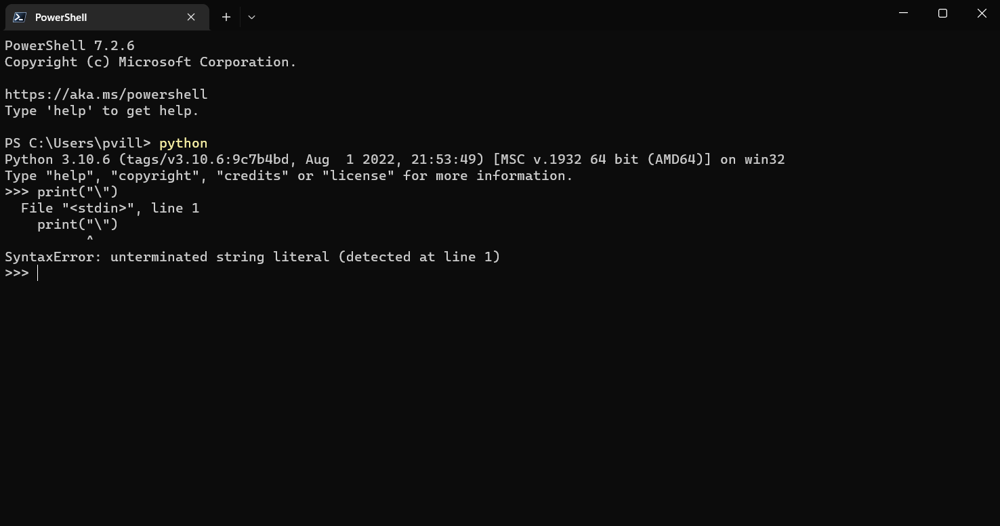
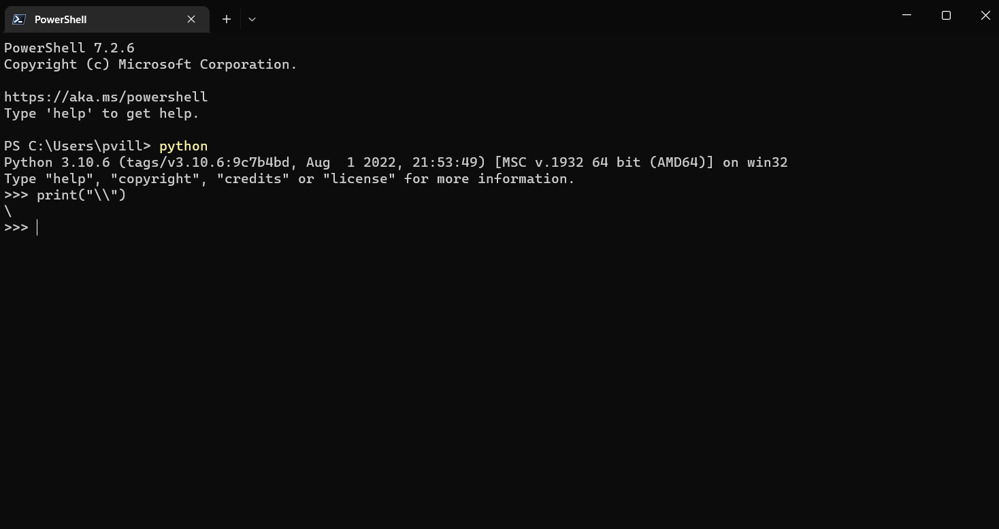
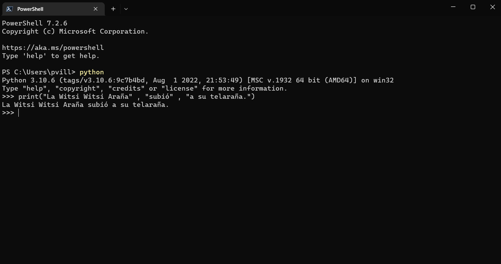
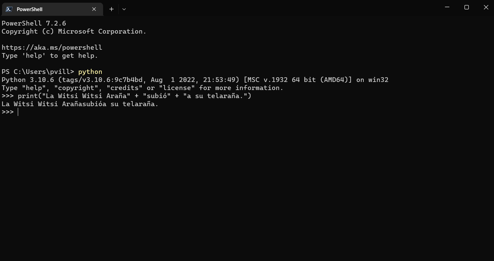

# Usando la consola

Con ustedes, la consola!!

Charán!! 🥳




Para muchos ver la consola es intimidante. Parece que vas a echar todo a perder si haces algo mal o que es algo que usan los hackers en las películas. Pues nada de eso, la verdad. El uso de la consola es muy frecuente en la programación y usarla es muy útil.

Una de las cosas extrañas al usar la consola es que casi no se usa el mousse. Prácticamente todo se hace con el teclado. Por lo que usarla requiere algo de práctica. Bueno, como todo en la vida, en todo caso.

Vamos a usar la consola para escribir la primeras líneas de código con Python. 

Recuerda que en el capítulo anterior está explicado cómo configurar la consola. En particular, yo estoy usando Windows y PowerShell como la consola, que tiene algunas funciones más avazadas que la consola por defecto. Puedes encontrarla gratis en la Microsoft Store. Solo busca por la palabra "powershell" (sin las comillas). Además, igual revisa en tu computador, muchas veces ya viene instala con el sistema operativo, aún cuando quizás necesites actualizarla. Por si acaso, igual visita el Store para revisar nuevas versiones.




## Hola mundo!

Un clásico de todo quien esté aprendiendo un lenguaje de programación es el realizar un Hola Mundo!
Pues haremos el nuestro.

Primero, es necesario verificar si tenemos instalado correctamente Python en nuestra computadora. Para eso, escribimos "python" en la consola y le damos a enter. Si todo está ok, debería aparacer la versión de Pyhton que tenemos instalada y poner los símbolos >>>



Si no sale eso, [revisa el camítulo anterior](https://github.com/paulovillarroel/aprendiendo_python/blob/main/03_instalaciones/03_instalaciones.md) en donde realizamos las instalaciones de los programas. 

Cuando ejecutas el comando "python" en la consola, lo que está pasando es que se empieza a ejecutar el IDLE (Integrated Development and Learning Environment). Este es el intérprete interactivo de Python en la consola. Si quieres averiguar más de este tema, puedes visitar la documentación oficial en https://docs.python.org/3/library/idle.html 


Una vez ya dentro de Python, vamos a usar nuestra primera función del lenguaje: **print**

Print se usa para imprimir en pantalla algún mensaje, valor de una variable o varias más cosas. Imprimir por pantalla significa que lo muestra en la consola. 

```
>>> print("Hola Mundo")
Hola Mundo
>>>
```




Fíjate en algunos detalles...

Como puedes ver, el primer programa consta de las siguientes partes:

- La palabra print
- Un paréntesis de apertura
- Una comilla
- Una línea de texto: Hola Mundo
- Otra comilla
- Un paréntesis de cierre

Ya que estamos en ésta, veamos en más profundidad la función print.


## La función Print()

Cuando escribes esta línea de código:

```
>>> print("Hola Mundo")
```

Date cuenta que **print** es el nombre de la función. 

Una función (en este contexto) es una parte separada del código de computadora el cual es capaz de:

- Causar algún efecto (por ejemplo, enviar texto a la terminal, crear un archivo, dibujar una imagen, reproducir un sonido, etc.)
- Evaluar un valor (por ejemplo, la raíz cuadrada de un valor o la longitud de un texto dado) y devolverlo como el resultado de la función.

¿De dónde provienen las funciones?

Pueden venir de Python mismo. La función print es una de este tipo; dicha función es un valor agregado de Python junto con su entorno (está integrada); no tienes que hacer nada especial (por ejemplo, pedirle a alguien algo) si quieres usarla. Viene por defecto con el lenguaje. 
Pueden provenir de uno o varios de los módulos de Python llamados complementos; algunos de los módulos vienen con Python, otros pueden requerir una instalación por separado, cual sea el caso, todos deben estar conectados explícitamente con el código.
Puedes escribirlas tú mismo, colocando tantas funciones como desees y necesites dentro de su programa para hacerlo más simple, claro y elegante.
El nombre de la función debe ser significativo (el nombre de la función print es evidente), imprime en la terminal. Esto es que el nombre de la función describe bien lo que hace (recuerda que están en inglés por convención). 


Ok. Volvamos a la consola...

¿Qué pasa si solo ponemos print()?


Pues se imprime una línea vacía en la consola.


Dentro del intérprete de Python, veamos que podemos usarlos como una calculadora. Sumemos 1 + 3. La consola nos imprime el resultado, que es 4.

```
>>> 1+3
4
>>>
```

Podemos hacer la misma suma usando la función print.

```
>>> print(1+3)
4
>>>
```

Con Python no solo podemos sumar, sino que podemos usar muchas otras funciones matemáticas:

```
print(2 + 3)   # addition(+)
print(3 - 1)   # subtraction(-)
print(2 * 3)   # multiplication(*)
print(3 / 2)   # division(/)
print(3 ** 2)  # exponential(**)
print(3 % 2)   # modulus(%)
print(3 // 2)  # Floor division operator(//)
```

Acá es necesario hacer algunos alcances con respecto de ciertos operadores.

- Modulus: este es el resto de la división de 2 números. Por ejemplo, 2/3 = 0.666666. El módulo de 2/3 es 2, que es el numero que queda abajo de todo cuando lo haces a mano, como en el colegio. Recuerdas? Si la división es justa, sin resto, el módulo es 0.
- Floor division: esto es a división de los números, pero cuando tiene decimales se aproxima al valor inferior (por eso lo de floor o piso).


Ya volveremos más adelante con los operadores matemáticos. Por ahora quedémonos con ésto.

Veamos algunas variaciones o complementos que podemos usar con print:
```
>>> print("La Witsi Witsi Araña\nsubió a su telaraña.\n")
La Witsi Witsi Araña
subió a su telaraña.

```

Acá estamos usando un escape (\) y una forma de saltarse una línea usando \n
El concepto del escape es cuando usamos un caracter delante de otro para cambiar la forma en que el intérprete los ejecuta. Por ejemplo al usar la mezcla \n le estamos diciendo a Python que no considere el caracter n como una letra, sino como un salto de línea. Fíjate que el ejemplo anterior tiene 2 de éstos. Mira el resultado. 

Fíjate en el siguiente ejemplo:



La tratar de imprimir "\" nos arroja error. Esto es porque este caracter es considerado como un escape y al no tener nada que escapar, da error. Para que esto salga bien, se debe usar doble barra \\ .

Veamos este ejemplo usando la doble barra para poder escapar correctamente e imprimir \:




En la función print podemos usar múltiples argumentos. Es decir, pasarle varias cosas dentro del ().
Veamos el siguiente ejemplo:



Acá le estamos pasando 3 argumentos a print, cada trozo de texto está encerrado por "" y separados pr una coma. Podemos usar todos los argumentos que queramos.
También podemos unir los argumentos con el signo +, pero tiene algunos detalles. Mira este ejemplo:



Se ve raro, no?
Se imprime: La Witsi Witsi Arañasubióa su telaraña. Todo junto, sin espacios. Esto es porque si usamos el operador + entre los argumentos, lo que sucede es que se concatenan (se unen). Esto es muy útil, pero para otras ocaciones. Ya lo veremos.

Otra cosa interesante con print, es el uso de los argumentos con palabras claves. Acá veamos un ejemplo de cómo poner un separador entre los argumentos al interior de la función print:

```
>>> print("Mi", "nombre", "es", "Monty", "Python.", sep="-")
Mi-nombre-es-Monty-Python.
```

Podríamos usar otro separador:
```
>>> print("Mi", "nombre", "es", "Monty", "Python.", sep="*")
Mi*nombre*es*Monty*Python.
```


### En resumen

1. La función print() es una función integrada imprime/envía un mensaje específico a la pantalla/ventana de consola.

2. Las funciones integradas, al contrario de las funciones definidas por el usuario, están siempre disponibles y no tienen que ser importadas.

3. Para llamar a una función (invocación de función), debe utilizarse el nombre de la función seguido de un paréntesis. Puedes pasar argumentos a una función colocándolos dentro de los paréntesis. Se Deben separar los argumentos con una coma, por ejemplo, print("¡Hola,", "Mundo!"). una función print() "vacía" imprime una línea vacía a la pantalla.

4. Las cadenas de Python están delimitadas por comillas, por ejemplo, "Soy una cadena", o 'Yo soy una cadena, también' (se pueden usar comillas dobles o simples. lo importante es ser consistente. Si pones una al inicio, poner otra al final del mismo tipo).

5. Los programas de computadora son colecciones de instrucciones. Una instrucción es un comando para realizar una tarea específica cuando se ejecuta, por ejemplo, para imprimir un determinado mensaje en la pantalla.

6. En las cadenas de Python, la barra diagonal inversa (\) es un carácter especial que anuncia que el siguiente carácter tiene un significado diferente, por ejemplo, \n (el carácter de nueva línea) comienza una nueva línea de salida.

7. Los argumentos posicionales son aquellos cuyo significado viene dictado por su posición, por ejemplo, el segundo argumento se emite después del primero, el tercero se emite después del segundo, etc.

8. Los argumentos de palabra clave son aquellos cuyo significado no está dictado por su ubicación, sino por una palabra especial (palabra clave) que se utiliza para identificarlos.


Más adelante seguiremos revisando más sobre el uso de print y el resto de las funciones integradas en Python.

Hasta ahora, ya vamos avanzando muy bien!!


[**<< CAPITULO ANTERIOR**](https://github.com/paulovillarroel/aprendiendo_python/blob/main/03_instalaciones/03_instalaciones.md)