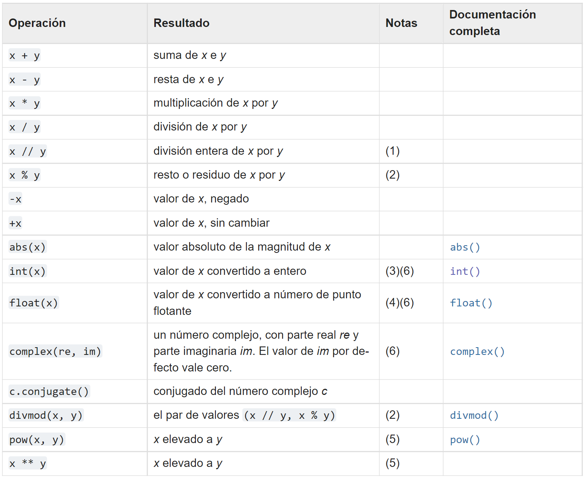
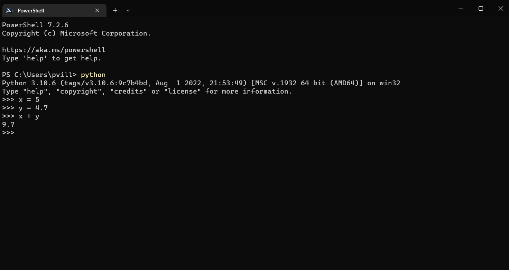

# Tipos de datos

Una de las cosas fundamentales y que debemos entender, son los tipos de datos que se pueden usar con Python. Eso es muy relevante para analizar el diseño de los programas que generemos y qúe y cómo vamos a usar los datos.

Los tipos de datos son bastante diversos, pero podemos agruparlos en:

- Numéricos
- Secuencias
- Mapas
- Clases
- Instancias
- Excepciones


Vamos a ir por partes, pues este tema es extenso y no tan simple en algunos casos. Pero es significativo el comprenderlos y saber cómo administrarlos, puees eso puede determinar mucho el buen desempeño de nustro código y soluciones.

De todas formas, en la [documentación oficial de Python](https://docs.python.org/es/3/library/stdtypes.html) hacen un análisis bastante detallado de los tipos de datos. Si quieres profundizar más, te aconsejo darle una lectura después de leer y estudiar este artículo.

Al final, el intérprete lo que hace es traducir el código de alto nivel que escribimos a código computador, que son básicamente puros 0 y 1 ordenados de tal forma que el computador los pueda entender. 

Puedes entender un poco mejor del código binario (esos unos y ceros) en el siguiente video:

[](https://youtu.be/f9b0wwhTmeU)


Para efectos prácticos, en este capítulo revisaremos:

- Numéricos:
    - integer
    - float
    - complex
    - boolean
- Secuencias:
    - list
    - tuple
    - range
    - string


## Datos numéricos

Acá encontramos:
- int (integer o enteros)
- float (coma flotante o decimales)
- complex (complejos)

Es importante entender la diferencia entre enteros y decimales, más allá de lo evidente, que es tener o no la separación de decimales. Para efectos prácticos, en Python (y para muchos lenguajes de programación, a verdad) la separación entre la parte entera y la decimal es con un punto (.) y con una coma (,). Esto que parece algo vanal, en realidad es super importante tenerlo en mente, pues muchos datasets (cunjuntos de datos) vienen con una coma como separador, y en latinomamérica es más común usar la coma que el punto. Esto  de usar puntos en vez de comas puede generar problemas a la hora de interpretar los datos. 

No solo eso, sino que desde el punto de vista del uso de la memoria del computador, almacenar un número entero es muy distinto a almacenar uno decimal. El computador hace un proceso muy distinto para guardar uno u otro dato. Suena loco, pero es así. Los almacena de forma distinta y ocupan un espacio de memora distinto. 

2 no es lo mismo que 2.0 para efecto del uso de los recursos computacionales. En poca cantidad, eso no debería importarte mucho, pero cuando el volumen es alto, esta diferencia puede ser muy relevante para no sobrepasar las capacidades de memoria. 

Pero una pregunta básica y que parece obvia, pero que no lo es tanto, es saber qué son los números.

[](https://youtu.be/H9pMUV4leQg)

Los numero complejos son aquellos que tienen una parte real y otra imaginaria (viste el video, no?)

Ok, ya con esas definiciones en la cabeza, sigamos...

Los números se crean a partir de una expresión literal (o sea, que lo escribes directamente en el editor de texto), o como resultado de una combinación de funciones predefinidas y operadores. Expresiones literales de números (incluyendo números expresados en hexadecimal, octal o binario) producen enteros. Si la expresión literal contiene un punto decimal o un signo de exponente, se genera un número en coma flotante. Si se añade como sufijo una 'j' o una 'J' a un literal numérico, se genera un número imaginario puro (Un número complejo con la parte real a cero), que se puede sumar a un número entero o de coma flotante para obtener un número complejo con parte real e imaginaria.

Python 3.6 ha introducido el guion bajo en los literales numéricos, permitiendo colocar un guion bajo entre dígitos y después de especificadores de base para mejorar la legibilidad. Esta característica no está disponible en versiones anteriores de Python.

```
>>> 11_22
1122
>>>
```

¿Cómo se codifican los números negativos en Python? Como normalmente se hace, agregando un signo de menos. Se puede escribir: -11111111, o -11_111_111.

Los números positivos no requieren un signo positivo antepuesto, pero es permitido, si se desea hacer. Las siguientes líneas describen el mismo número: +11111111 y 11111111.


### Enteros: números octales y hexadecimales

Existen dos convenciones adicionales en Python que no son conocidas en el mundo de las matemáticas. El primero nos permite utilizar un número en su representación octal.

Si un número entero esta precedido por un código 0O o 0o (cero-o), el número será tratado como un valor octal. Esto significa que el número debe contener dígitos en el rango del [0..7] únicamente.

0o123 es un número octal con un valor (decimal) igual a 83.

La función print() realiza la conversión automáticamente. Intenta esto en la consola:

```
>>> print(0o123)
83
```

La segunda convención nos permite utilizar números en hexadecimal. Dichos números deben ser precedidos por el prefijo 0x o 0X (cero-x).

0x123 es un número hexadecimal con un valor (decimal) igual a 291. La función print() puede manejar estos valores también. Intenta esto:

```
>>> print(0x123)
291
```

Esta diferenciación también tiene como objetivo el optimizar el uso de la memoria para almacenar datos. Sé que no lo parece, pero es relevante tener estos conceptos en mente. 


### Operaciones

Con los números (excepto con los complejos) puedes realizar las siguientes operaciones matemáticas:



Notas:

1. También conocida como división entera. El resultado es un número entero en el sentido matemático, pero no necesariamente de tipo entero. El resultado se redondea de forma automática hacia menos infinito: 1//2 es 0, (-1)//2 es -1, 1//(-2) es -1 y (-1)//(-2) es 0.

2. No es apropiada para números complejos. Es preferible convertir a valores en coma flotante usando la función abs() si fuera apropiado.

3. Conversiones desde coma flotante a entero pueden redondearse o truncarse como en C; véanse las funciones math.floor() y math.ceil() para un mayor control.

4. float también acepta las cadenas de caracteres «nan» e «inf», con un prefijo opcional «+» o «-», para los valores Not a Number (NaN) e infinito positivo o negativo.

5. Python define pow(0, 0) y 0 ** 0 para que valgan 1, como es práctica habitual en los lenguajes de programación.

6. Los literales numéricos aceptables incluyen los dígitos desde el 0 hasta el 9, así como cualquier carácter Unicode equivalente (puntos de código con la propiedad Nd).


No olvides, al igual que con los cálculos matemáticos, hay prioridades de operación. Como la clásica regla que las multiplizaciones y divisiones de hacen antes que los las sumas y restas. Te recuedas del colegio? Bueno, en Python también hay prioridades de ejecución. Son hartas y hemos visto solo algunas hasta hora, pero en la [documentación oficial puedes tener más información](https://docs.python.org/es/3/reference/expressions.html#operator-summary).


Algunas consideraciones importantes al realizar operaciones con los números...

Una divisíon (/) siempre dará como resultado un número flotante.

```
>>> 3/5
0.6
```

Como puedes imaginar, el valor de cero punto cuatro puede ser escrito en Python como:

```
>>> 0.4
```

Pero no hay que olvidar esta sencilla regla, se puede omitir el cero cuando es el único dígito antes del punto decimal. En esencia, el valor 0.4 se puede escribir como:

```
>>> .4
```

Veamos algo nuevo, ya lo profundizaremos, pero es una de las grandes cosas de Python (y de otros lenguajes orientados a objetos), es que puedes crear **variables**. Esto es la bomba!!! 😱

Mira el siguiente ejemplo:



Acá se crean 2 variables (x, y) y a cada una se le asigna un valor (5 y 4.7 respectivamente). Luesgo realizamos una suma simple. Observa que el intérprete entiende que como se han definido esos valores previamente, los puede usar para el cálculo. Mira lo que pasa cuando no definimos una variable antes de la operación en donde se hace referencia.


Pues arroja un error: name 'y' is not defined.

Bueno, ya sabes porqué pasó eso. No definimos el valor de la variable y antes. 


## Flotates

Sigamos con los datos numéricos. Ahora veamos algo más de los datos flotantes.

Ya vimos que el computador almacena de forma muy distinta los números enteros de los decimales. Ahora veamos una de las aplicaciones más frecuentes al usar decimales: el exponente (e).

Mira lo que pasa cuando tratamos de imprimir el número 0.0000000000000000000001

```
>>> print(0.0000000000000000000001)
1e-22
```

Nos devuelve un valor en notación científica: 1e-22

Fíjate que aunque le estamos pasando un número flotante a print(), éste nos devuelve uno complejo. Python siempre elige la presentación más corta del número, y esto se debe de tomar en consideración al crear literales.

Python soporta completamente una aritmética mixta: Cuando un operador binario de tipo aritmético se encuentra con que los operadores son de tipos diferentes, el operando con el tipo de dato más «estrecho» o restrictivo se convierte o amplia hasta el nivel del otro operando. Los enteros son más *estrechos* que los de coma flotante, que a su vez son más estrechos que los números complejos. 

Fíjate en el siguiente ejemplo:

```
>>> 3 + 4.6
7.6
```

Esta característica es importante de recordar al momento de diseñar tus programas, te puede dar un error o mutar una variable (cambiar el tipo de variable) sin darte cuenta y generar un resultado no esperado. Perdón que hable nuevamente de las variables, ya las veremos en detención, y en Python todo es un objeto (o una variable). Ya lo veremos.


Volvamos un poco a nuestra querida consola...

Usaremos la funcion *type()* para identificar el tipo de dato que le pasamos y *print()*. Veamos unos ejemplos.

```
>>> print(type(4))
<class 'int'>
>>> print(type(4.7))
<class 'float'>
>>> print(type(3j))
<class 'complex'>
>>> print(type(4.0))
<class 'float'>
>>> print(type(4.6337))
<class 'float'>
```

Lo mismo podemos hacer si asignamos una variable y le pasamos type:

```
>>> x = 3.88
>>> print(type(x))
<class 'float'>
```

## Booleanos

Con los números podemos realizar operaciones artiméticas, como es de esperarse. Pero también podemos compararlos. Para ello, sumamos unos tipos especiales de comparadores: >, <, >=, <=, ==

Como resultados de usar estos comparadores, nos arrojará un dato de tipo Booleano. Es decir, un dato que solo tiene 2 estados: True o False (T, F).
Veamos algunos ejemplos:

```
>>> 3 > 6
False
>>> 3 < 6
True
>>> 3 == 4
False
>>> 3 == 3
True
>>> 4 >= 3
True
>>> 5.9 > 5.8
True
>>> 3e-2 < 3e-3
False
```

Fíjate que para comprara si 2 dato son iguales se usa un doble signo igual (==). Esto es para diferenciarlo de cuando se usa solo 1 signo igual (=) que es para asignar un valor a una variable u objeto. 

Así como podemos comparar si 2 valores coinciden, podemos analizar si no coinciden. Para eso usamos !=

```
>>> 5 != 7
True
```

El nombre de booleano proviene de George Boole (1815-1864), el autor de Las Leyes del Pensamiento, las cuales definen el Álgebra Booleana - una parte del álgebra que hace uso de dos valores: Verdadero y Falso, denotados como 1 y 0.

```
>>> True == 1
True
>>> False == 0
True
>>> True > False
True
```

En los ejemplos anteriores puedes notar algo interesante. El intérprete considera a False como un 0 y a True como un 1. Recuerda que en computación todo se resuelve con 1 y 0. Por eso, las evalauciones de veracidad (que es finalmente para lo que se usan esos comparadores) arrojan esos resultados.


Veamos qué pasa en el siguiente ejemplo:

```
>>> 4 > "Casa"
Traceback (most recent call last):
  File "<stdin>", line 1, in <module>
TypeError: '>' not supported between instances of 'int' and 'str'
```


Le estamos pidiendo a Python que nos diga si 4 es mayor que la palabra "Casa". La verdad es que no se puede hacer eso. El error nos da pistas del motivo de la falla, y es que estamos comparando un dato numérico tipo integer contra uno de tipo string (str). No podemos hacer esa comparación. Ya veremos en más detalles los datos de tipo cadena de caracteres o string. Solo como adelanto, mira el siguiente ejemplo y trata de pensar porqué pasa lo que pasa:

```
>>> "casa" > "ojo"
False
>>> "torta" < "abanico"
False
>>> "raton" > "conejo"
True
>>> "kjsadkjsdg" > "abuhdjkhkj"
True
>>>
```

Esto de la evaluación es bastante más amplia y se puede complicar bastante, en particular al usar flujos con *if* o *while*. Esto lo veremos más adelante, pero el control de flujo es una de las cosas más importantes en programación y es algo que debes manejar muy bien. El especificar cuando el computador debe hacer algo o no, o qué camino tomar ante determinadas condiciones, es algo que brinda una potencia increíble a tu código. Pero eso lo veremos más adelante con calma pues requiere práctica.


## Secuencias

Acá tenemos a:

- list (lista)
- tupla (tupla)
- range (rango)

Para usar y trabajar con este tipo de datos podemos hacer muchas cosas, muchas. En capítulos posteriores se detallarán en más profundidad varias funciones que se pueder realizar para cada uno de esas secuencias. Por ahora, los describiré por encima más que nada para que comprendas de que estamos hablando y no sea chino más adelante cuando hagamos referencias a estos datos.


### Listas

Una lista es una colección de diferentes tipos de datos que está ordenada y es modificable (mutable). Una lista puede estar vacía o puede tener elementos de diferentes tipos de datos. Esta característica de mutabilidad es importante. Ya lo mencioné más arriba muy por encima, pero para poder revisar estos tipos de datos debemos profundizar un poco más en ese tema.

Podemos crear una lista usando estas 2 sintaxis:

```
>>> my_list = list()
>>> my_other_list = []
```

Usando la función interna de Python list() y también sin usar esa función, pero encerrando los datos entre paréntesis cuadrados []. Si solo se usa eso, se crearán listas vacías (sin elementos). Mira el ejemplo siguiente, usamos una función nueva: *len()*

len() permite evaluar la longitud (lenght) del objeto que le pasas. En este caso, como le estamos pasando una lista vacía, nos imprime cero (0).

```
>>> empty_list = []
>>> print(len(empty_list))
0
```

Veamos unos ejemplos de listas:

```
fruits = ['banana', 'orange', 'mango', 'lemon']
person = ["Paulo", 40, "Chile"]
```


### Tuplas

Una tupla es una colección de diferentes tipos de datos que está ordenada y es inmutable. Las tuplas se escriben con corchetes, (). Una vez creada una tupla, no podemos cambiar sus valores. No podemos utilizar los métodos add, insert, remove en una tupla porque no es modificable (mutable). A diferencia de las listas, las tuplas tienen pocos métodos. Ya veremos eso en unos capítulos más adelante.

Podemos crear una tupla usando estas 2 sintaxis:

```
>>> my_tuple = tuple()
>>> my_other_tuple = ()
```

Nota que acá para crear una tupla se usan los paréntesis (), a diferencia de las listas que se usaban los corchetes cuadrados [].

Veamos unos ejemplos de tuplas:

```
fruits = ('banana', 'orange', 'mango', 'lemon')
person = ("Paulo", 40, "Chile")
```

### Rangos

Los objetos de tipo *range* representan una secuencia inmutable de números y se usan habitualmente para ejecutar un bucle *for* un número determinado de veces. esto básicamente generar una serie de números secuenciales o en un orden estricto, desde un inicio (start) hasta un fin (stop)

Ok. Esto suena extraño, pero no lo es. Con un ejemplo debería quedar más claro.

```
>>> range(10)
range(0, 10)
>>> print(range(10))
range(0, 10)
>>> list(range(10))
[0, 1, 2, 3, 4, 5, 6, 7, 8, 9]
>>> x = range(10)
>>> x
range(0, 10)
>>> print(x)
range(0, 10)
>>> list(x)
[0, 1, 2, 3, 4, 5, 6, 7, 8, 9]
```

Nota que para imprimir el resultado del range es necesario aplicarle la función list(). Puedes asignar un objeto (o variable) a ese rango. En el ejemplo se está generando una serie secuencial de 10 valores. Por defecto, el primer valor es el 0 (o índice cero) y luego los siguientes 9 números enteros, ya que el 10 se considera como el *stop*. Considera que éste número no se consigna en el objeto, solo se llega hasta el 9. 


Ahora en el siguiente ejemplo, partimos del 3 (start) y paramos (stop) en el 10:

```
>>> list(range(3, 10))
[3, 4, 5, 6, 7, 8, 9]
```

Ahora le pasaremos un tercer argumento. Ya hemos usado start y stop, ahora usaremos *step*. Este argumento le agrega la posibilidad al rango de generar la secuencia de números cada "ciertos saltos". Mira este ejemplo:

```
>>> list(range(3, 20, 3))
[3, 6, 9, 12, 15, 18]
```

Acá le estamos pasando 3 al argumento step. Esto genera que la secuencia sea cada 3 números. Por defecto se usa 1, pero puedes modificarlo como se ve.

Más detalles los veremos en los próximos capítulos.


### Cadenas de caracteres

El texto es un tipo de datos de cadena (string o str). Cualquier tipo de dato escrito como texto es una cadena. Cualquier dato bajo comillas simples, dobles o triples son cadenas. Hay diferentes métodos de cadena y funciones incorporadas para tratar los tipos de datos de cadena.

Las cadenas de caracteres son secuencias inmutables.

Entonces, podemos crear un dato tipo string de alguna de estas 3 formas:

- Comillas simples: 'permite incluir comillas "dobles"'
- Double quotes: "allows embedded 'single' quotes"
- Triples comillas: ya sea con comillas simples '''Triples comillas simples''' o dobles """Triples comillas dobles"""

Las cadenas definidas con comillas tripes pueden incluir varias líneas. Todos los espacios en blancos incluidos se incorporan a la cadena de forma literal.

```
>>> """Esta es una cadena de
... caracteres de varias
... líneas"""
'Esta es una cadena de \ncaracteres de varias\nlíneas'
```

Ya los vimos en el capítulo anterior el uso de \n. Este operador nos indica un salto de línea en el texto. Como usamos comillas triples, podemos crear un string de varias líneas y Python nos lo interpreta como tal, con esos saltos de línea. Interesante, no?

Al igual que culaquier otro tipo de dato, podemos usar la función type() para conocer el tipo:

```
>>> print(type("Esta es una cadena de caracteres"))
<class 'str'>
```

Acá hay bastante por revisar con los strings. El conocerlos te puede ser de gran utilidad. Esto es especiallmente úitl a la hora de trabajar con textos, webscraping y modelos de inteligencia artificial basada en el análisis de texto. Pero me estoy adelantando demasiado jajajaj Ya los reremos con clama más adelante.


Hasta acá vamos a dejar este capítulo que se ha hecho bastante largo la verdad y es bastante información. Revísao con calma, practica y mueve los deditos en tu computador para ir ejercitando los ejemplos. 

Hay varios más tipos de datos, pero los iremos reviando en la medida que lo necesitemos próximamente. 

[**<< CAPITULO ANTERIOR**](https://github.com/paulovillarroel/aprendiendo_python/blob/main/04_usando_la_consola/04_usando_la_consola.md)