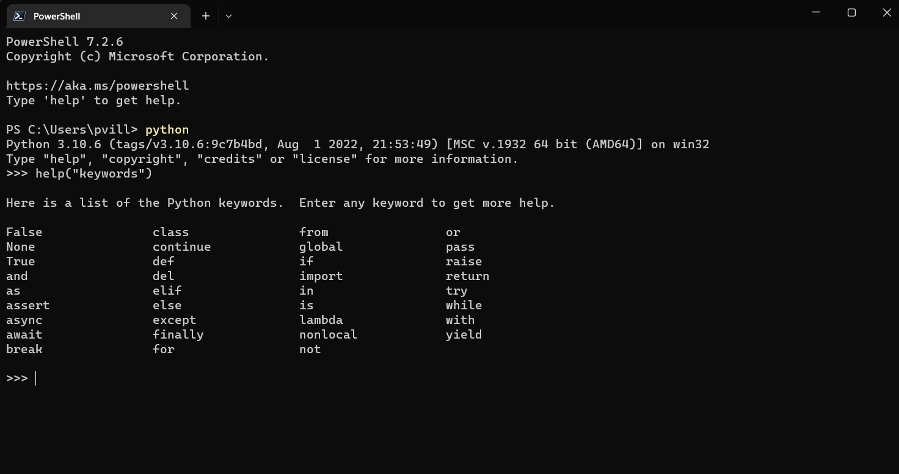
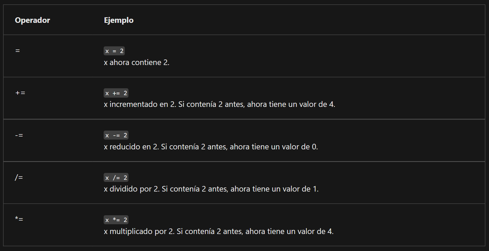
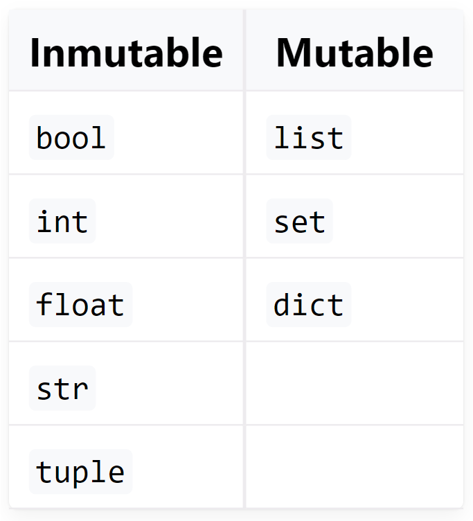

# Variables

En este capítulo abordaremos un poco más en profundidad algo de lo que ya hemos estado trabajando. Las variables.

También, aprovecharé de revisar las funciones integradas con la que ya cuenta Python, y de las cuales ya hemos hablado antes.


Las variables son fundamentales ya que permiten definir nombres para los valores que tenemos en memoria y que vamos a usar en nuestro programa. Es ponerle un etiqueta para luego poder trabajar con ellas. Acá puede que use la palabra variable u objeto de forma similar e indistinta.

Pero, ¿Qué es una variable?

Piensa en una variable como una caja, a la cual le puedes meter cualquier cosa dentro. Y esta caja ocupa cierto espacio en tu memoria del computador. 

Ya hemos visto que podemos usar Python como una calculadora y aplicar operaciones matemáticas a números. Pero si queremos guardar los resultados, debemos usar una variable. 

¿Cuáles son los componentes o elementos de una variable en Python?

- Un nombre.
- Un valor (el contenido del contenedor).


Las variables no aparecen en un programa automáticamente. Como desarrollador, tu debes decidir cuantas variables deseas utilizar en tu programa. También las debes de nombrar. Pero para ello, debes seguir una buenas prácticas, que son lineamientos que hacen más simple tu código de entender, tanto para ti como para otros. 

- El nombre de la variable debe de estar compuesto por MAYÚSCULAS, minúsculas, dígitos, y el carácter _ (guion bajo).
- El nombre de la variable debe comenzar con una letra.
- El carácter guion bajo es considerado una letra.
- Las mayúsculas y minúsculas se tratan de forma distinta (un poco diferente que en el mundo real - Alicia y ALICIA son el mismo nombre, pero en Python son dos nombres de variable distintos, subsecuentemente, son dos variables diferentes).
- El nombre de las variables no pueden ser igual a alguna de las palabras reservadas de Python (se explicará más de esto pronto).


## Algo más de los nombres de variables

Nota que la misma restricción aplica a los nombres de funciones.
Python no impone restricciones en la longitud de los nombres de las variables, pero eso no significa que un nombre de variable largo sea mejor que uno corto.
Los nombres de las variables deben ser **significativos**. Esto es que son autoexplicables al leerlos y su nombre representa de buena forma lo que tiene dentro.

Aquí se muestran algunos nombres de variable que son correctos, pero que no siempre son convenientes:

```
MiVariable, i, t34, Tasa_Cambio, contador, dias_para_navidad, ElNombreEsTanLargoQueSeCometeranErroresConEl, _.
```

[PEP 8 -- Style Guide for Python Code](https://peps.python.org/pep-0008/) recomienda la siguiente convención de nomenclatura para variables y funciones en Python:

- Los nombres de las variables deben estar en minúsculas, con palabras separadas por guiones bajos para mejorar la legibilidad (por ejemplo: var, mi_variable).
- Los nombres de las funciones siguen la misma convención que los nombres de las variables (por ejemplo: fun, mi_función).
- También es posible usar letras mixtas (por ejemplo: miVariable), pero solo en contextos donde ese ya es el estilo predominante, para mantener la compatibilidad retroactiva con la convención adoptada.


## Palabras claves

También se llaman palabras reservadas, pues son parte del lenguaje y no se pueden usar, excepto para lo que fueron creadas. Si lo intentas, obtendrás un error de sintaxis. No se pueden usar ni para nombrar variables, funciones ni cualquier otra cosa.

En este ejemplo, tratamos de crear una variable de nombre lambda y con el valor "hola". Como lambda es una palabra reservada, no podemos.

```
>>> lambda = "hola"
  File "<stdin>", line 1
    lambda = "hola"
           ^
SyntaxError: invalid syntax
```

Las palabras reservadas (o claves) son:

```
['False', 'None', 'True', 'and', 'as', 'assert', 'break', 'class', 'continue', 'def', 'del', 'elif', 'else', 'except', 'finally', 'for', 'from', 'global', 'if', 'import', 'in', 'is', 'lambda', 'nonlocal', 'not', 'or', 'pass', 'raise', 'return', 'try', 'while', 'with', 'yield']
```

Puedes buscarlas usando la consola. Para ello, debes colocar help('keywords')




Ahora, podrías "burlar" este error de sintaxis, realizando un pequeño cambio en el nombre de la variable, por ejemplo, agregando una letra mayúscula. Recuerda que para Python, las mayúsculas y las minúsculas se tratan como valores distintos.

```
>>> Lambda = "hola"
>>> Lambda
'hola'
```

Ahora, a pesar de que se pueda, no es recomendable hacer eso. Solo generará confusión y posibles errores. 


## Creando una variable

Una variable se crea cuando se le **asigna un valor**. A diferencia de otros lenguajes de programación, no es necesario declararla.

Si se le asigna cualquier valor a una variable no existente, la variable será automáticamente creada. No se necesita hacer algo más.

El valor de la variable puede variar tanto como se necesite o requiera. Esto es imporante de considerar, pues puedes mutar una variable. Eso puede ser algo pensado y requerido, pero a veces el cambiar los valores de una variable pueden ser un error o algo no esperado. 

La creación (o su sintaxis) es muy simple: solo utiliza el nombre de la variable deseada, después el signo de igual (=) y el valor que se desea colocar dentro de la variable. Ya lo hemos realizado antes.

```
>>> var = 1
>>> print(var)
1
```

Sobre la mutabilidad de las varibles, revisemos estos ejemplos:

```
>>> x = 6
>>> y = 5
>>> x + y
11
>>> x = 10
>>> x + y
15
```

```
>>> x = 4
>>> y = x + 4
>>> x + y
12
```

Fíjate en el último ejemplo. Se ve complejo, pero revisemos paso a paso.

- Se crea la variable x y se le asigna el valor 4
- Se crea la variable y con las asignación de x + 4
- Como ya habíamos definido que x es 4, y vale 4 + 4
- Luego sumamos x + y, es decir, 4 + 4 + 4 
- Nos da 12 como resultado


Si vemos el valor de y luego de ejecutar el código, puedes notar que y ya no es x+4, sino que ahora es 8. Ha mutado.

```
>>> y
8
```

Como ya vimos, podemos crear una variable asignarle cualquier valor, como un string

```
>>> my_string = "Este es un string"
>>> print(my_string)
Este es un string
```


**Un ejemplo: Resolviendo problemas matemáticos simples**

Ahora deberías de ser capaz de construir un corto programa el cual resuelva problemas matemáticos sencillos como el Teorema de Pitágoras:
El cuadrado de la hipotenusa es igual a la suma de los cuadrados de los dos catetos.

Lo recuerdas?? Es del colegio, de básica.

El siguiente código evalúa la longitud de la hipotenusa (es decir, el lado más largo de un triangulo rectángulo, el opuesto al ángulo recto) utilizando el Teorema de Pitágoras:

Supongamos un triángulo de lados 3 y 4 (catetos) y queremos saber el valor de la hipotenusa.

```
>>> a = 3.0
>>> b = 4.0
>>> c = (a ** 2 + b ** 2) ** 0.5
>>> print("c =", c)
c = 5.0
```


### Operadores abreviados

Es tiempo de explicar el siguiente conjunto de operadores que harán la vida del programador/desarrollador más fácil.

Muy seguido, se desea utilizar la misma variable al lado derecho y al lado izquierdo del operador =.

Por ejemplo, si se necesita calcular una serie de valores sucesivos de la potencia de 2, se puede usar el siguiente código:

```
x = x * 2
```

Python ofrece una manera más corta de escribir operaciones como estas, lo cual se puede codificar de la siguiente manera:

```
x *= 2
```

Este operador se puede usar con cualquiera de los operadores aritméticos que vimos en el capítulo anterior. Acá algunos de ellos:




Revisa estos ejemplos. Dale una vuelta, aplícalos en tu consola y ve que resultados obtienes:

```
i = i + 2 * j ⇒ i += 2 * j

var = var / 2 ⇒ var /= 2

rem = rem % 10 ⇒ rem %= 10

j = j - (i + var + rem) ⇒ j -= (i + var + rem)

x = x ** 2 ⇒ x **= 2
```


Otra posibilidad, es crear varias variables en solo 1 línea de código. Esto no es muy recomendable, puede ser confuso y poco mantenible, pero en determinadas situaciones pudiera ser útil.

Por ejemplo:

```
>>> first_name, last_name, country, age, is_married = 'Paulo', 'Villarroel', 'Chile', 40, False
>>> print(first_name, last_name, country, age, is_married)
Paulo Villarroel Chile 40 False
>>> print(first_name)
Paulo
>>> print(last_name)
Villarroel
>>> print(country)
Chile
>>> print(age)
40
>>> print(is_married)
False
>>>
```

Ya veremos algunas variaciones o cosas que podemos hacer con esta forma de crear variables. 


Unas palabras sobre la mutabilidad y la inmutabilidad...

Recuerda que las variables son un nombre y un valor asignado. Pero depende del tipo de dato que contenga una variable, ésta puede ser mutable o no. Que sea mutable es que puede ir variando en la medida que se vaya redifiniendo el valor de ésta, como lo vimos en algunso ejemplos más arriba.

Este cuadro te ayudará a saber qué tipos de datos son mutables y cuales no:




## Funciones integradas o built-in

Así como algunas palabras reservadas, Python tiene funciones que vienen incluídas en el lenguaje. 
Estas funciones permiten realizar diversas operaciones muy útiles en programación. No son las únicas, se pueden agregar más funciones por medio de librerías externas o creando las propias, pero eso lo veremos más adelante. 

Las funciones integradas son (en orden alfabético):


Puedes revisar más detalles en la [documentación oficial de Python](https://docs.python.org/3.9/library/functions.html). 


Para complementar los que hemos visto en este capítulo y el anterior, puedes revisar estos breves cursos sobre los tipos de datos y funciones. 

- Tipos de datos https://realpython.com/courses/python-data-types/
- Variables https://realpython.com/courses/variables-python/}
- Inmutabilidad https://realpython.com/courses/immutability-python/ 


[**<< CAPITULO ANTERIOR**](https://github.com/paulovillarroel/aprendiendo_python/blob/main/05_tipos_datos/05_tipos_datos.md) 

