# Operadores

En Python encontramos los siguientes operadores:

- Operadores aritméticos
- Operadores de asignación
- Operadores de comparación
- Operadores lógicos
- Operadores de identidad
- Operadores de pertenencia
- Operadores a nivel de bits (bitwise)


## Operadores arirméticos

Como es de esperar, estos operadores permiten realizar operaciones aritméticas.

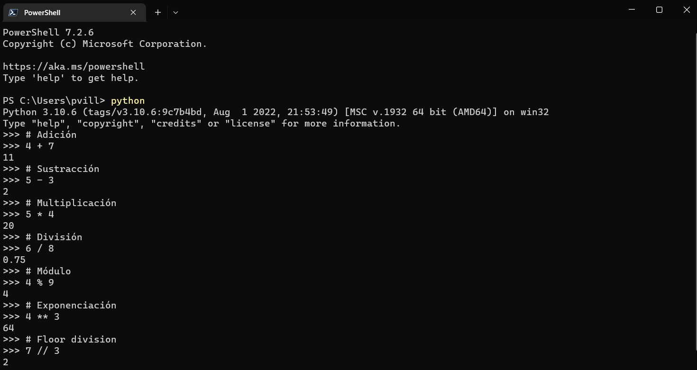


## Operadores de asignación

Estos operadores se usan para asignar valores a las variables.

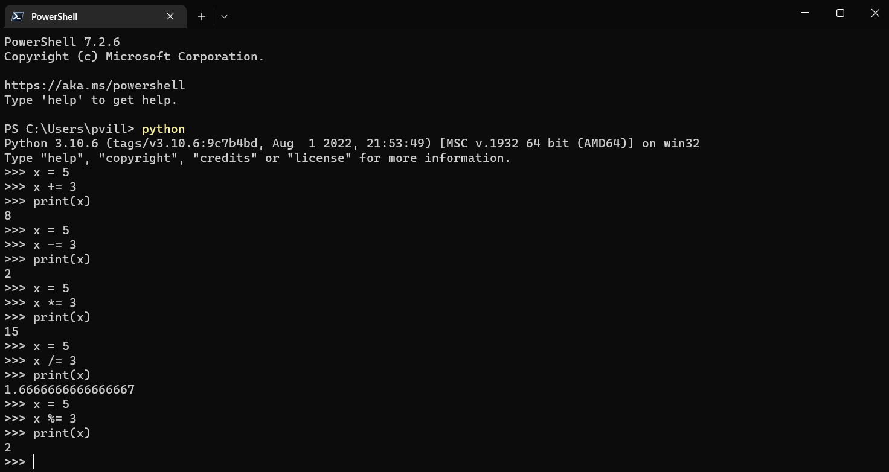
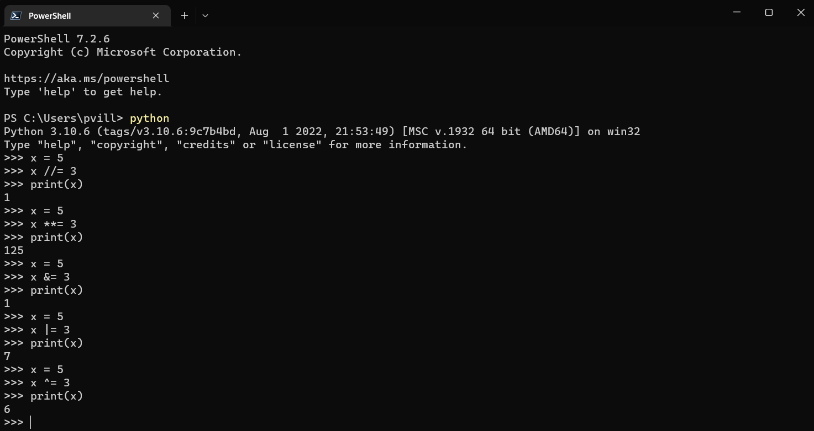
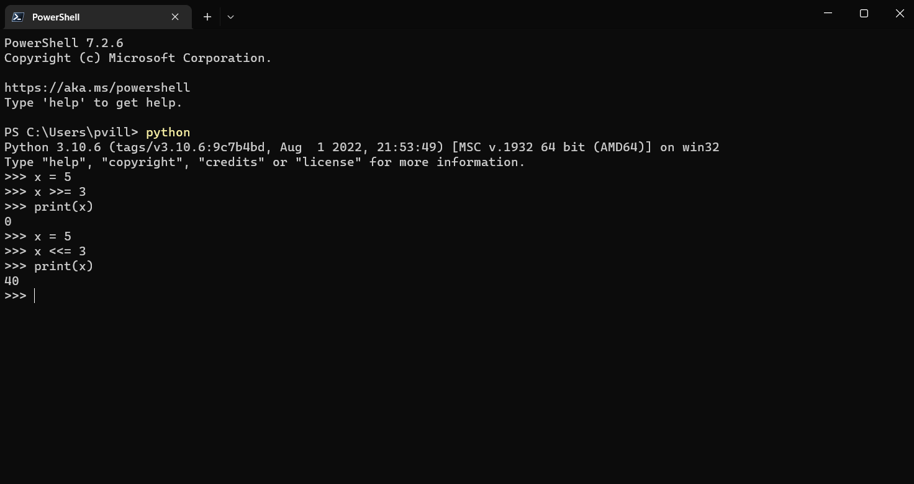

En los ejemplos aparecen algunos operadores que no habíamos visto antes, como &, |, <<, >>, >>= y <<=. Éstos hacen referencia a cálculos con datos binarios (si, esos con solo unos y ceros). Básicamente, se convierten los valores enteros (solo funciona con éstos) a su correspondiente binario y la operación de comparación se realiza bit a bit. 

Estamos hablando de los Operadores a nivel de bits (bitwise)


## Operadores Bitwise

Complementando a lo anterior, podemos revisar que la lógica de comparación usada para cada caso es:

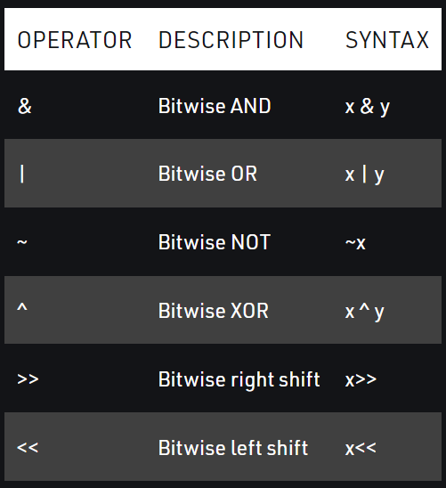

Esto se puede ver de mejor forma en los siguientes ejemplos:

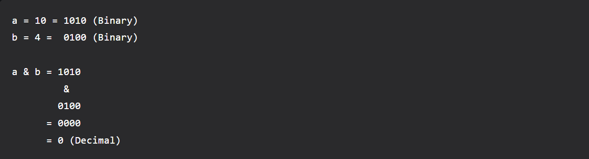
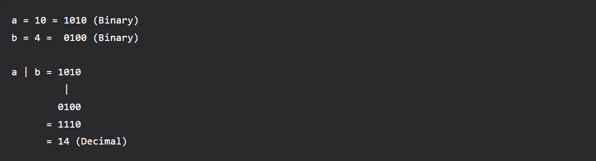
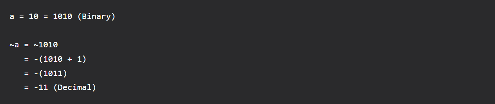


Por ahora no profundizaré más en estos operadores, pues tienen usos bastante específicos. Por ahora basta saber que están ahí y son parte del lenguaje. Cuando sea necesario, los retomaremos.


## Operadores de identidad (identity)

Estos operadores comparan 2 objetos si son iguales o no, pero no si "son iguales en sus elementos", sino que si son el mismo objeto. Es decir, si usan el mismo espacio de memoria. 

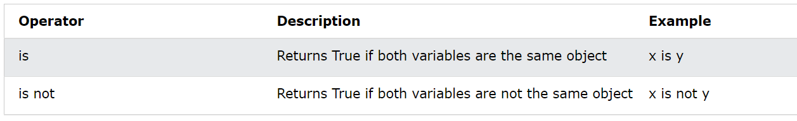

Acá veamos un ejemplo:

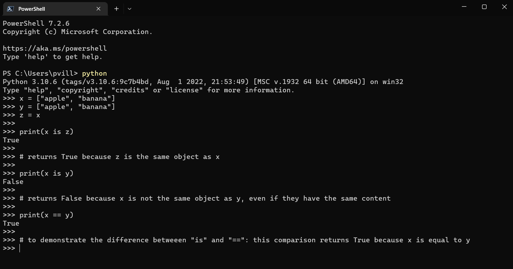

En este caso, al ejecutar print(x is z) nos arroja True, pues se están definiedo uno al otro como iguales (z = x). Son, entonces, el mismo objeto.
Luego al comprar x con y nos arroja False, pues no son el mismo objeto, aún cuando tienen los mismos valores en cada uno. Son distintos objetos, pues ocupan (o se les asignan) distintos espacios en la memoria del computador. 

Una forma de saber el espacio que tiene asignado una variable, es uando una función integrada del Python es *id()*. Fíjate en e siguiente ejemplo que el id(x) es el mismo que el id(z). Por eso en el caso anterior, nos daba True al compararlos.

```
>>> id(x)
1723089369088
>>> id(y)
1723089355328
>>> id(z)
1723089369088
```


## Operadores de pertenencia (membership)

Estos operadores calculan si un elemento está dentro de una variable o no. Arroja un booleano como resultado (True o False).

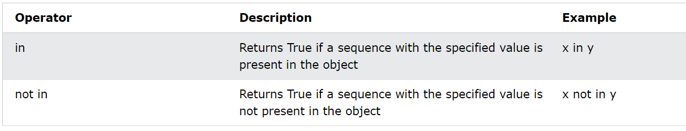

Mira este ejemplo:

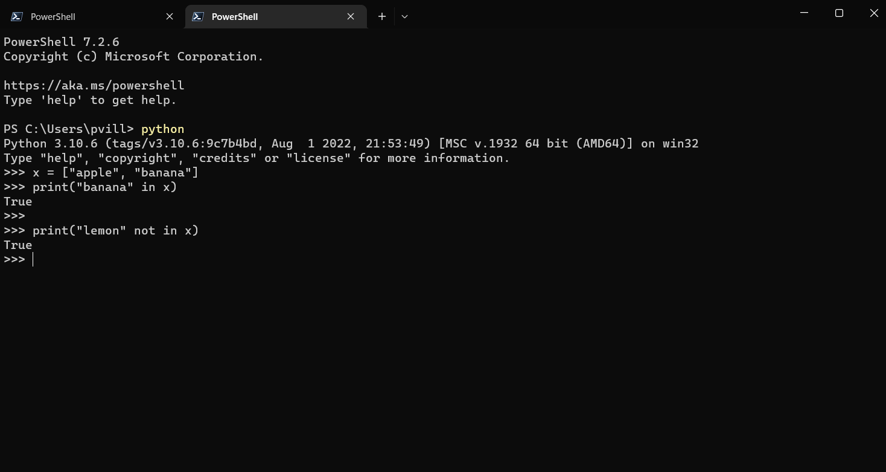


## Operadores de comparación (comparison)

Estos operadores permiten comparar valores.

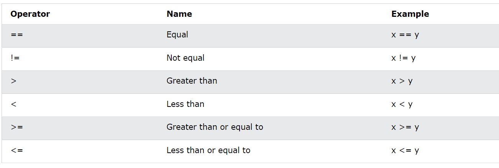

Veamos unos ejemplos:


Pero este tipo de operadores no solo se pueden aplicar a valores numéricos, también podemos aplicarlos a datos tipo strings (str), pero para eso hay que usar la función *len()* que calcula la longitud del string. entonces, al compararlos es a travésde su longitud como se ve en los siguientes ejemplos:

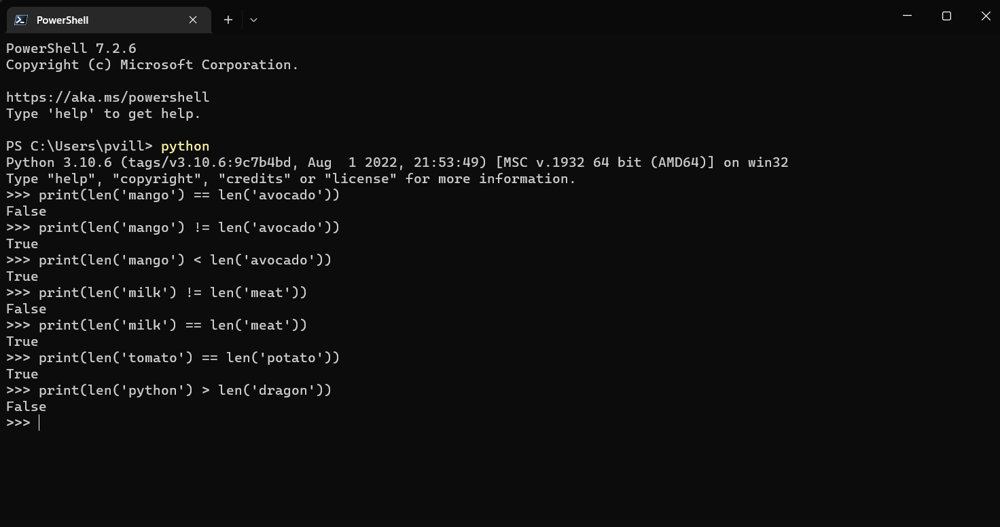


## Operadores lógicos (logical)

Los operadores lógicos se utilizan para combinar declaraciones condicionales.

Estos operadores los veremos en su uso en espacial cuando revisemos el uso de condicionales y control de flujos (if, else, elif).

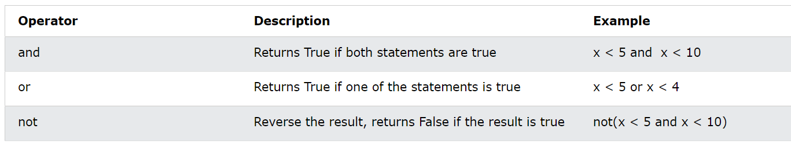

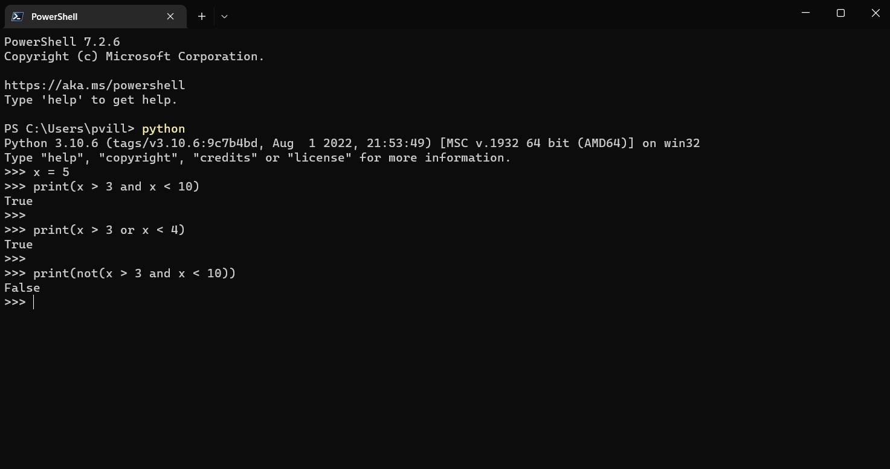


[**<< CAPITULO ANTERIOR**](https://github.com/paulovillarroel/aprendiendo_python/blob/main/06_variables_funciones/06_variables_funciones.md) | 