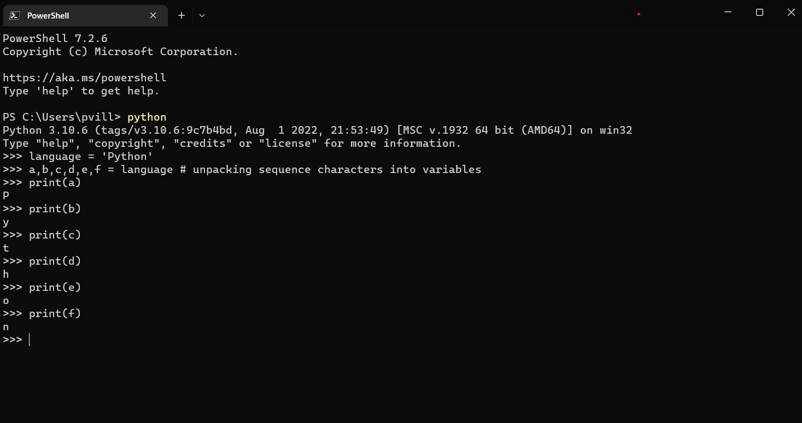
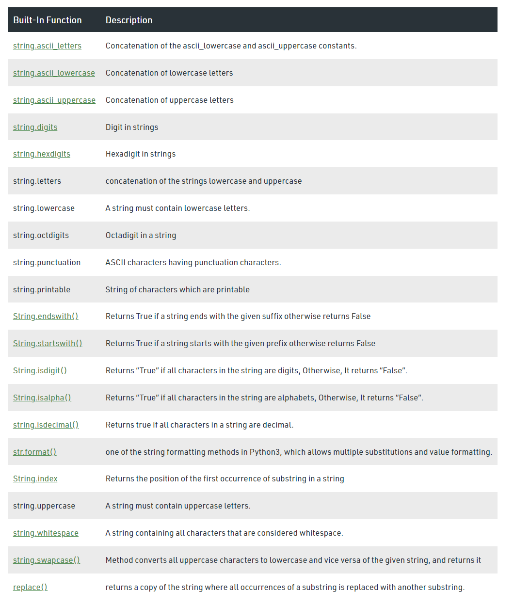

# Strings

A contar de este capítulo y por varios más, profundizaré en algunos tipos de datos o estructuras vistas en el capítulo de [tipos de datos](https://github.com/paulovillarroel/aprendiendo_python/tree/main/05_tipos_datos).

En este veremos los strings o cadenas de texto.

Empecemos!!! 🥳

Como ya sabemos, los strings son cadenas de texto. O sea, texto. Simple. Ahora, esto no solo se refiere a letras, sino también a caracteres y muchos más. Ojo, que los espacios también son caracteres y se consideran como texto. Mira el siguiente ejemplo.

```
>>> print(type(" "))
<class 'str'>
```


## ¿Cómo crear un string?

Hay varias formas de hacerlo...

```
>>> letter = 'P'
>>> print(letter)
P
>>> print(len(letter))
1
>>> greeting = 'Hello, World!'
>>> print(greeting)
Hello, World!
>>> print(len(greeting))
13
>>> sentence = "I hope you are enjoying 30 days of Python Challenge"
>>> print(sentence)
I hope you are enjoying 30 days of Python Challenge
```

Fíjate que los strings se puedes crear usando tanto comillas simples (') como dobles (").

¿Cuál usar? El que te acomode más, la verdad. Hay un caso en que es necesario usar ambos y es cuando quieres envolver todo un trozo de código y dentro hay algunas comillas. Para eso, se usan una y otra para diferenciarlas. Es poco común, pero es bueno tenerlo en mente.

Ahora, también se pueden usar comillas triples (tanto simples como dobles) para crear varias líneas de texto. Un párrafo casi.

```
multiline_string = '''I am a teacher and enjoy teaching.
I didn't find anything as rewarding as empowering people.
That is why I created 30 days of python.'''

# Another way of doing the same thing
multiline_string = """I am a teacher and enjoy teaching.
I didn't find anything as rewarding as empowering people.
That is why I created 30 days of python."""
```


## Concatenación

Concatenar es unir, en este caso, texto.

Para concatenar 2 textos se usa el símbolo + (suma) y puede ser usado varias veces en la misma expresión. 

Veamos un ejemplo...

```
>>> print("Este es" + "un ejemplo" + "de concatenación")
Este esun ejemplode concatenación
```

Nota que sale extraña la unión. LAs palabras están juntas y no hay espacios entre todas las palabras. Recuerda que el espacio es un caracter y debe indicarse explícitamente en la expresión. No olvides que para programar hay que ser precisos. Veamos nuevamente el ejemplo, y fíjate en los espacios agregados.

```
>>> print("Este es " + "un ejemplo " + "de concatenación")
Este es un ejemplo de concatenación
```

Como ya lo hemos hecho antes, podemos pasarle nombres de variables con valores de texto y concatenarlas.

```
>>> text1 = "Este es mi primer texto"
>>> text2 = "Este es mi otro texto"
>>> print(text1 + " " + text2)
Este es mi primer texto Este es mi otro texto
```

Podemos agregra algunos otros elementos que son interesantes, como \n para un salto de línea. Miremos...

```
>>> print("Esta es una línea\nEsta es otra línea")
Esta es una línea
Esta es otra línea
```

También podemos hacer lo siguiente:

```
>>> first_name = "Paulo"
>>> last_name = "Villarroel"
>>> space = " "
>>> full_name = first_name + space + last_name
>>> print(full_name)
Paulo Villarroel
```


## Escapes

Como estamos hablando de texto, podríamos querer imprimir un / y no que nos ejecute una división por ejemplo. O imprimir un * y no multiplicar. Para eso, necesitamos escapar los caracteres, de modo que Python entienda que lo que deseamos es unar el caracter como tal y no como operador. Para ello debemos anteponer un \ a cada caracter (que es lo que usamos previamente para salto de línea). Miremos...

```
\n: new line
\t: Tab means(8 spaces)
\\: Back slash
\': Single quote (')
\": Double quote (")
```
```
>>> print('I hope everyone is enjoying the Python Challenge.\nAre you ?')
I hope everyone is enjoying the Python Challenge.
Are you ?
>>> print('Days\tTopics\tExercises')
Days    Topics  Exercises
>>> print('Day 1\t3\t5')
Day 1   3       5
>>> print('Day 2\t3\t5')
Day 2   3       5
>>> print('Day 3\t3\t5')
Day 3   3       5
>>> print('Day 4\t3\t5')
Day 4   3       5
>>> print('This is a backslash  symbol (\\)')
This is a backslash  symbol (\)
>>> print('In every programming language it starts with \"Hello, World!\"')
In every programming language it starts with "Hello, World!"
```


## Formateo

Podemos realizar diversos tipos  de formatos a los strings. En Python 3 se agregaron varias opciones en este caso.

Se puede incrustar texto desde variables, especificando el lugar donde queremos incluirlo y qué variable usaremos (el orden).}

```
>>> first_name = "Paulo
>>> last_name = "Villarroel"
>>> language = "Python"
>>> formated_string = "I am {} {}. I teach {}".format(first_name, last_name, language)
>>> print(formated_string)
I am Paulo Villarroel. I teach Python
```

Fíjate que usamos {} para indicar el lugar donde va a ir una variable. Luego, con el *.format()* señalamos el orden de la variables que vamos a poner en cada {} previamente definido.

Podemos usar los {} de otra forma y aplicar operaciones aritméticas:

```
>>> a = 4
>>> b = 3
>>>
>>> print("{} + {} = {}".format(a, b, a + b))
4 + 3 = 7
>>> print("{} - {} = {}".format(a, b, a - b))
4 - 3 = 1
>>> print("{} * {} = {}".format(a, b, a * b))
4 * 3 = 12
>>> print("{} / {} = {:.2f}".format(a, b, a / b))   # {:.2f} es para especificar solo 2 decimales
4 / 3 = 1.33
>>> print("{} % {} = {}".format(a, b, a % b))
4 % 3 = 1
>>> print("{} // {} = {}".format(a, b, a // b))
4 // 3 = 1
>>> print("{} ** {} = {}".format(a, b, a ** b))
4 ** 3 = 64
```

Otra forma de hacer los mismo anterior, es usando la interpolación. Para eso, usamos una *f*. Mira los siguientes ejemplos. Son los mismos de arriba, pero usando el otro formato:

```
>>> a = 4
>>> b = 3
>>>
>>> print(f"{a} + {b} = {a +b}")
4 + 3 = 7
>>> print(f"{a} - {b} = {a - b}")
4 - 3 = 1
>>> print(f"{a} * {b} = {a * b}")
4 * 3 = 12
>>> print(f"{a} / {b} = {a / b:.2f}")
4 / 3 = 1.33
>>> print(f"{a} % {b} = {a % b}")
4 % 3 = 1
>>> print(f"{a} // {b} = {a // b}")
4 // 3 = 1
>>> print(f"{a} ** {b} = {a ** b}")
4 ** 3 = 64
```


## Replicación

Podemos repetir un texto determinadas veces. Básicamente, es un string * number (o viceversa).

```
>>> "Hola" * 5
'HolaHolaHolaHolaHola'
```


## Secuencias de caracteres

Podemos entender a las cadenas de texto como una serie de caracteres unidos. En Python podemos acceder o realizar distintas acciones por caracter y no solo por palabra completa (por decirlo de alguna forma). Se consideran como estructuras ordenadas. 

Se puede desempaquetar (unpack) un texto de la siguiente forma:



Fíjate que separamos la palabra Python en cada una de sus letras y le asignamos una variable a cada una de ellas. Y como es una estructura ordenada, podemos acceder a cada una de los índices. En el siguiente ejemplo, creamos una variable llamada language que tiene como valor "Python". Recuerda que en Python el indexado parte por 0. Es decir, que el primer elemento tiene una posición 0 (cero). Le sigue el 1, luego el 2 y así. Por eso, cuando queremos acceder a la primera letra lo hacemos usando language[0].

Así como podemos acceder al primer caracter, podemos hacerlo al útlimo de forma simple. En este caso, usamos [-1]. Si usamos [-2] accedeemos al penúltimo carater.

```
>>> language = "Python"
>>> language[0]
'P'
>>> language[2]
't'
>>> language[-1]
'n'
>>> language[-2]
'o'
```

Del mismo modo, podemos acceder a un grupo de caracteres y no solo a uno. Para eso podemos hacerlo de la siguiente forma:

```
>>> language = "Python"
>>> language[0:3]
'Pyt'
>>> language[-3:]
'hon'
```

También podemos invertir la cadena de texto:

```
>>> greeting = "Hello, World!"
>>> print(greeting[::-1])
!dlroW ,olleH
```


## Métodos

Con algunas funciones podemos formatear el texto de distintas formas. 

capitalize: pone la primera letra de cada palabra en mayúscula.
```
challenge = 'thirty days of python'
print(challenge.capitalize()) # 'Thirty days of python'
```

count: cuenta cuántos caracteres (definidos) hay en el string. Se apllica count(substring, start=.., end=..)
``` 
challenge = 'thirty days of python'
print(challenge.count('y')) # 3
print(challenge.count('y', 7, 14)) # 1
print(challenge.count('th')) # 2
```

endswith: verifica si el string termina de una forma especificada. Arroja un booleano (True o False).
```
challenge = 'thirty days of python'
print(challenge.endswith('on'))   # True
print(challenge.endswith('tion')) # False
```

find: encuentra el índice de la primera ocurrencia del caracter buscado.
```
challenge = 'thirty days of python'
print(challenge.find('y'))  # 5
```

replace: reemplaza un estring por otro.
```
challenge = 'thirty days of python'
print(challenge.replace('python', 'coding')) # 'thirty days of coding'
```

split: separa las palabras por un separador definido.
```
challenge = 'thirty days of python'
print(challenge.split()) # ['thirty', 'days', 'of', 'python']
challenge = 'thirty, days, of, python'
print(challenge.split(', ')) # ['thirty', 'days', 'of', 'python']
```


Otros métodos...




Estos son algunos de los metodos. La verdad, es que son bastantes. Lo mejor es ir investigándolos en la medidad que se vayan usando o requiriendo. No vale la pena aprenderlos todos. Este campo es bastante amplio. Gigante. De hecho, el estudio del texto es una de la ramas de inteligencia artificial con más desarrollo en el último tiempo, en especial, el análisis de texto natural, es decir, como escribimos las personas. Por ahora, con todo esto basta de sobra.

Puedes mirar más detalles en [este tutorial](https://www.geeksforgeeks.org/python-string/). 

[**<< CAPITULO ANTERIOR**](https://github.com/paulovillarroel/aprendiendo_python/blob/main/08_comentarios/08_comentarios.md) |