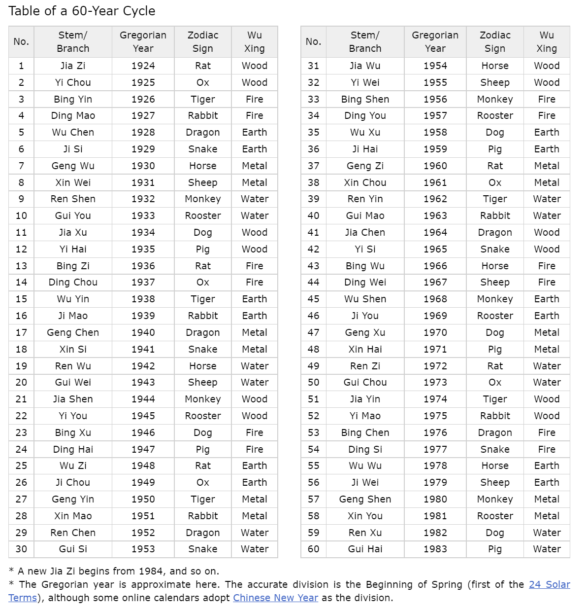
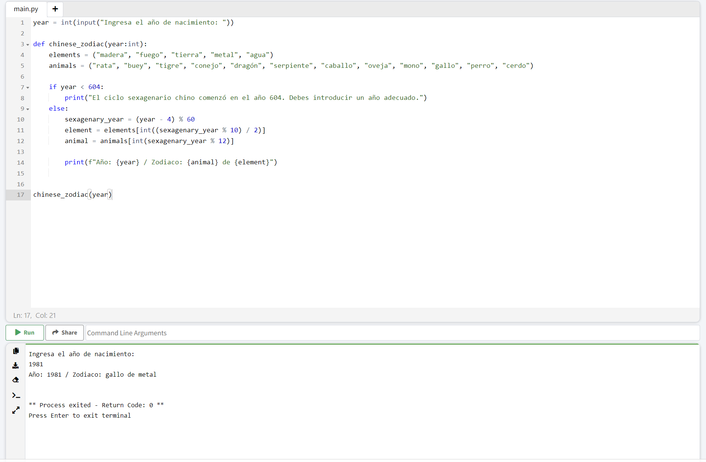

# El Zodiaco chino

En esta ocasión vamos a hacer algo distinto a lo que estábamos reelizando. Nos vamos a poner a crear un pequeño programa en Python. Esto se super interesante, pues está super bien el estudiar, escribir código y ver tutoriales, pero es más interesante el realizar proyectos, aunque sean pequeños o simples. Esa es la mejor forma de aprender (junto con enseñar a otros).

A lo largo de esta ruta de aprendizaje iremos realizando diversos proyectos para poner en práctica lo que vayamos aprendiendo.

Ahora vamos a realizar un programa (una función) que nos permita, dado un determinado año, nos indique el animal y el elemento correspondiente al ciclo sexagenario del zodiaco chino.

El ciclo sexagenario corresponde a 60 años que se van repitiendo, en donde cada año tiene asignado una combinación de animales y sus elementos. Puedes ver más informacón en https://www.travelchinaguide.com/intro/astrology/60year-cycle.htm

- Elementos: madera, fuego, tierra, metal, agua.
- Animales: rata, buey, tigre, conejo, dragón, serpiente, caballo, oveja, mono, gallo, perro, cerdo.

Este es el ciclo sexagenario anterior completo:




## El programa

Veamos cómo podemos desarrollar este programa.

Revisemos nuevamente lo que queremos que haga el programa.

El programa debe ser capaz de decirnos el animal y el elemento que corresponda, al indicarle un año cualquiera.

Revisemos cómo se arma el ciclo y sus combinaciones.

- El ciclo anterior parte en el año 1924
- Los animales no se repiten en cada vuelta
- Los elementos se repiten 2 veces
- El nuevo ciclo parte el 1984 y corresponde a rata de madera

Si investigamos un poco en [Wikipedia](https://es.wikipedia.org/wiki/Ciclo_sexagenario), vemos que los años del ciclo sexagenario con coinciden exactamente con el calendario occidental. Muchos años del ciclo parten o terminan en los meses de Enero o Febrero y no necesariamente del 1 enero al 31 diciembre. 

También vemos que este ciclo sexagenario se adoptó oficialmente en el año 604 en China.

Acá tenemos que realizar una **función** con Pyhton. Una función es, a grandes rasgos, definir (con un nombre) una serie de reglas que se deben realizar en un orden determinado, a la cual le pasamos un input y que nos debe arrojar un output deseado. Y este elemento es reusable. Es decir, que podemos invocarlo las veces que queramos.

Qué tenemos...

- El input: un año determinado
- El output: animal y elemento que corresponde al año del input

Qué necesitamos...

- Desarrollar una función que al pasarle un año, nos de el animal y elemento del zodiaco chino correspondiente.

Ok, hasta ahora no hemos visto cómo realizar una función. Entonces, revisemos un poco el tema.

Una función en Python se define con la siguiente sintaxis:

```
def function_name():
    codes
    codes
``` 

Revisemos...

Una función se crea con la palabra reservada *def*. Luego se define un nombre a la función (ya vimos cómo llamar a las variables y para las funciones aplican los mismos criterios), en los paréntesis se especifica el parámetro a usar. Luego se ponen los 2 puntos. 
Seguido de ello, se escribe el código necesario para realizar la tarea que queremos. Acá es importante que consideremos la indentación. La indentación es cuando dejamos espacios a la izquierda de una línea de código y que indica que es parte de lo que está arriba. En Python, la indentación es un concepto muy importante. Muchas veces tendremos problemas con el código, y varias podrían corresponder a problemas de indentación. 

Este tema de las funciones lo veremos más en detalle un poco más adelante, pero volvamos a nuestro programa del zodiaco.

Definamos nuestra función zodiacal.

1. Creamos la función chinese_zodiac con el parámetro year (que es el input que tenemos que pasarle). 

```
def chinese_zodiac(year):
``` 

2. Especficamos el tipo de dato que queremos del parámetro. En ese caso, year es un integer:

``` 
def chinese_zodiac(year:int):
``` 

3. Tenemos animales y elementos, que vamos a incluir dentro de la función. Crearemos una lista para cada uno de ellos y las asignaremos a variables:

```
def chinese_zodiac(year:int):
    elements = ("madera", "fuego", "tierra", "metal", "agua")
    animals = ("rata", "buey", "tigre", "conejo", "dragón", "serpiente", "caballo", "oveja", "mono", "gallo", "perro", "cerdo")
``` 

4. Con esto ya tenemos nuestra función, pero no hace nada. Para llamar (o invocar) una función lo hacemos de la siguiente forma:

Acá le pasamos el año 1981. Pero no da ningún outpu, pues no hemos especificado nada dentro de la función. Solo hemos definido nuestras listas.

``` 
chinese_zodiac(1981)
``` 

5. Vimos que el ciclo sexagenario se hizo oficial en el año 604, por tanto antes de esa fecha no existen ciclos. Esta información es importante, pues nuestra función no debería permitir pasarle años aneriores al 604. Para eso, acá vamos a introducir un concepto nuevo, que son los condicionales o control de flujo. Esto es básicamente decirle al programa qué camino tomar, dado si se umplen o no ciertas condiciones definidas. Para eso, usamos la palabra reservada *if*. 

``` 
def chinese_zodiac(year:int):
    elements = ("madera", "fuego", "tierra", "metal", "agua")
    animals = ("rata", "buey", "tigre", "conejo", "dragón", "serpiente", "caballo", "oveja", "mono", "gallo", "perro", "cerdo")

    if year < 604:
        code A
    else:
        code B

``` 

Lo que estamos realizando es que estamos estableciendo un if que lo hemos definido que si el año (year) es menor a 604, debe hacer algo. Eso no lo hemos especificado todavía. Además, agregamos otra palabra reservada, *else*. Esta es la otra parte del condicional y que se complementa con el if previo.

Acá tenemos que si el año es menor de 604, se hace algo (code A). Sino se cumple esa condición, se hará lo otro (code B). Es decir, si el resultado del if es True, se hace lo del if, si es False, se hace lo del else.

6. Ahora definamos qué hará la función si se cumple el if:

```
def chinese_zodiac(year:int):
    elements = ("madera", "fuego", "tierra", "metal", "agua")
    animals = ("rata", "buey", "tigre", "conejo", "dragón", "serpiente", "caballo", "oveja", "mono", "gallo", "perro", "cerdo")

    if year < 604:
        print("El ciclo sexagenario chino comenzó en el año 604.")
    else:
        code B
```
Vamos a decirle a nuestro programa que si la condición del if se cumple, nos imprima el mensaje "El ciclo sexagenario chino comenzó en el año 604.".

7. Ahora viene la parte más difícil de nuestra función, que es que pueda determnar los animales y elementos adecuados.

8. Para poder entender mejor lo que está psando con la función, voy a poner un print en el else (por ahora) para poder probar si funciona o no la función con lo que llevamos hasta ahora.

```
def chinese_zodiac(year:int):
    elements = ("madera", "fuego", "tierra", "metal", "agua")
    animals = ("rata", "buey", "tigre", "conejo", "dragón", "serpiente", "caballo", "oveja", "mono", "gallo", "perro", "cerdo")

    if year < 604:
        print("El ciclo sexagenario chino comenzó en el año 604.")
    else:
        print("Ahora hago esto")
```

Para que puedas probar este código, puedes usar este playground de Python (que es una web en donde puedes correr pedazos de código sin instalar nada) https://www.online-python.com/

Borra el código que sale por defecto, copia el siguiente código y pégalo. Luego dale al botón RUN para ejecutar el código.

```
def chinese_zodiac(year:int):
    elements = ("madera", "fuego", "tierra", "metal", "agua")
    animals = ("rata", "buey", "tigre", "conejo", "dragón", "serpiente", "caballo", "oveja", "mono", "gallo", "perro", "cerdo")

    if year < 604:
        print("El ciclo sexagenario chino comenzó en el año 604.")
    else:
        print("Ahora hago esto")

chinese_zodiac(500)
chinese_zodiac(1981)
```

Fíjate que agregué 2 invocaciones a la función, pasándole los años 500 y 1981. Se supone que como tenemos armada la función, si le pasamos el año 500, nos debería imprimir el mensaje de "El ciclo sexagenario chino comenzó en el año 604.". En el caso del año 1981, como es mayor que 604 y por tanto el if da False, nos imprime "Ahora hago esto".

Pruébalo!!!

9. Ok. Nuestra función funciona en cuanto toma un camino u otro, según el año que le pasamos como argumento. Pero sigamos...

10. Vimos que el ciclo sexagenario es una combinación de animales y elementos que siguen una lógica.

Los animales van de a 1, en un ciclo iterativo de 12.

Los elementos se van repitiendo cada 2 años, en un ciclo de 10 (5 elementos, 2 veces cada uno).

Entonces...

Para los elementos, como tenemos ciclos de 10 (en cada vuelta), para encontrar el que corresponda para un determinado año, podríamos usar el operador de módulo (%), que es una forma de encontrar el valor que correponde para el ciclo.

Acá le puse el año 1981 para probar el algoritmo. 

Tenemos nuestra lista de elementos:
```
>>> elements = ("madera", "fuego", "tierra", "metal", "agua")
```

Para acceder a un elemento de uan lista, lo hacemos señalando el nombre de la lista y entre [] el índice que deseamos. Si tomamos lo que dijimos de usar el módulo, pero lo dividiremos por 2, pues si bien el ciclo es de 10, solo son 5 elementos (la mitad, o sea, dividido en 2).

```
>>> (1981 % 10) / 2
0.5
```

11. Si le pasáramos ese valor como índice de la lista, nos arrojaría un error, pues el índice no acepta valores flotantes, sino que solo enteros. Por lo tanto, parsearemos (transformar) ese valor a un integer.

```
>>> int((1981 % 10) / 2)
0
```

Veamos que nos da eso al aplcarlo a la lista elements:

```
>>> elements[int((1981 % 10) / 2)]
'madera'
```

Recordemos que en Python el índice parte en 0 y el primer elemento de la lista es "madera".

12. Ahora hagamos lo mismo, pero con los animales:
```
>>> animals = ("rata", "buey", "tigre", "conejo", "dragón", "serpiente", "caballo", "oveja", "mono", "gallo", "perro", "cerdo")
>>> animal = animals[int(1981 % 12)]
>>> animal
'buey'
```

En este caso, usamos el módulo de 12, ya que el ciclo de los animales es de 12. No dividimos por nada, pues no se repiten.

13. Si te has fijado, hemos usado el año 1981 como ejemplo de prueba. Y nos ha arrojado madera y buey. Si vemos el calendario, observamos que esta mal. Debería habernos arrojado metal y gallo.

Algo que no hemos hecho, es considerar que el ciclo de años es de 60. Aplicando la misma lógica hasta ahora, usaremos el módulo y creamos una nueva variable:

```
>>> sexagenary_year = 1981 % 60
>>> sexagenary_year
1
```

14. Agregemos todo...

Pongo una variable year con valor 1981 como hemos estado realizando de ejemplo.

Para efectos de la función, como debe ser reutilizable, no es buena idea poner un año específico dentro de ésta, pues solo serviría para ese año. Entonces lo que podemos hacer es reemplazarlo por la variable year, de modo que si cambiamos el valor de year, la función se ajusta a ese dato.

Veamos qué resulta si le pasamos como argumentos 500 y 1981:

```
def chinese_zodiac(year:int):
    elements = ("madera", "fuego", "tierra", "metal", "agua")
    animals = ("rata", "buey", "tigre", "conejo", "dragón", "serpiente", "caballo", "oveja", "mono", "gallo", "perro", "cerdo")

    if year < 604:
        print("El ciclo sexagenario chino comenzó en el año 604.")
    else:
        sexagenary_year = year % 60
        element = elements[int((sexagenary_year % 10) / 2)]
        animal = animals[int(sexagenary_year % 12)]

chinese_zodiac(500)
chinese_zodiac(1981)
```

15. Si copias y pegas el código en el [playground](https://www.online-python.com/) verás que nos imprime el mensaje para el caso del año 500, pero nada más. Para el año 1981 qué ha pasado??

Bueno, al menos no arroja un error, eso ya es un avance. Pero aunque no se aparezca nada, el programa si está realizando algo, solo que no le hemos dicho que nos diga algo. Podemos usa un print para imprimir los valores de element y animal en el caso del else.

Agregaremo este print. Nota que estamos usando un formato de string como lo vimos en un capítulo anterior.

```
print(f"Año: {year} / Zodiaco: {animal} de {element}")
```

Este print lo ponemos dentro del else:

```
def chinese_zodiac(year:int):
    elements = ("madera", "fuego", "tierra", "metal", "agua")
    animals = ("rata", "buey", "tigre", "conejo", "dragón", "serpiente", "caballo", "oveja", "mono", "gallo", "perro", "cerdo")

    if year < 604:
        print("El ciclo sexagenario chino comenzó en el año 604.")
    else:
        sexagenary_year = year % 60
        element = elements[int((sexagenary_year % 10) / 2)]
        animal = animals[int(sexagenary_year % 12)]
        
        print(f"Año: {year} / Zodiaco: {animal} de {element}")

chinese_zodiac(500)
chinese_zodiac(1981)
```

16. Ahora si sale un resultado para ambos casos! Bien!

Y nos arroja lo que ya sabíamos, nos dice que el año 1981 corresponde al buey de madera, pero que no es correcto. 

Si te fijas bien, buey de madera corresponde al año 1925, que en el caso del ciclo, son 4 años previos. 

Veamos si le pasamos otros años y si sigue esa lógica de 4 años.

```
chinese_zodiac(1944)        # Año: 1944 / Zodiaco: rata de tierra
chinese_zodiac(1962)        # Año: 1962 / Zodiaco: caballo de fuego
chinese_zodiac(1980)        # Año: 1980 / Zodiaco: rata de madera
```

Observamos que al pasarle otros años, nos da el zodiaco desplazado en 4 años más.

17. Una forma de ajustar nuestro algoritmo, sería que al calcular el ciclo sexagenario, podríamos restar 4 al año.

```
sexagenary_year = (year - 4) % 60
```

Nos quedaría así..

```
def chinese_zodiac(year:int):
    elements = ("madera", "fuego", "tierra", "metal", "agua")
    animals = ("rata", "buey", "tigre", "conejo", "dragón", "serpiente", "caballo", "oveja", "mono", "gallo", "perro", "cerdo")

    if year < 604:
        print("El ciclo sexagenario chino comenzó en el año 604. Debes introducir un año adecuado.")
    else:
        sexagenary_year = (year - 4) % 60
        element = elements[int((sexagenary_year % 10) / 2)]
        animal = animals[int(sexagenary_year % 12)]

        print(f"Año: {year} / Zodiaco: {animal} de {element}")
```

18. Volvamos a probar los mismos años.

``` 
Año: 1944 / Zodiaco: mono de madera
Año: 1962 / Zodiaco: tigre de agua
Año: 1980 / Zodiaco: mono de metal
```

Probemos nuestro año de prueba (1981) que estábamos usando...

```
chinese_zodiac(1981)        # Año: 1981 / Zodiaco: gallo de metal
```

Perfecto!!! 🥳

Funciona!!!

19. Ya que tenemos nuestra función ok, podriamos hacer algo para que sea más interesante el programa.

En vez de invocar la función y escribir el año como parámatro, podemos pedirle al usuario que ingrese directamente el año. Para eso, usaremos la función *input()*.

Esta función espera que el usuario ingrese un dato y luego se ejecuta.

Vamos a asignar el valor ingresado por el usuario a la variable year:

```
year = int(input("Ingresa el año de nacimiento: "))
```

Lo debemos parsear a un integer, pues input() nos guarda un dato de tipo string. Y un string no se lo podemos pasar a nuestra función, no podemos realizar los cálculos aritméticos a una cadena de texto.

20. Nos queda...

```
year = int(input("Ingresa el año de nacimiento: "))

def chinese_zodiac(year:int):
    elements = ("madera", "fuego", "tierra", "metal", "agua")
    animals = ("rata", "buey", "tigre", "conejo", "dragón", "serpiente", "caballo", "oveja", "mono", "gallo", "perro", "cerdo")

    if year < 604:
        print("El ciclo sexagenario chino comenzó en el año 604. Debes introducir un año adecuado.")
    else:
        sexagenary_year = (year - 4) % 60
        element = elements[int((sexagenary_year % 10) / 2)]
        animal = animals[int(sexagenary_year % 12)]

        print(f"Año: {year} / Zodiaco: {animal} de {element}")
```

Y para invocar la función usamos:

```
chinese_zodiac(year)
```

21. Si copias y pegas todo el código en el playground, puedes probar cómo funciona.




El código que hemos realizado para el zodiaco chino lo puedes encontrar en un [archivo .py](https://github.com/paulovillarroel/aprendiendo_python/blob/main/10_zodiaco_chino/chinese_zodiac.py) (que es la extensión de los archivos de Python).


Intenta probar este código en el editor de texto Visual Studio Code.

Anda probando cosas. Recuerda que la única forma de aprender, es probar, practicar harto y mover las manitas jajaja.


[**<< CAPITULO ANTERIOR**](https://github.com/paulovillarroel/aprendiendo_python/blob/main/09_strings/09_strings.md) | [**SIGUIENTE CAPITULO >>**](https://github.com/paulovillarroel/aprendiendo_python/blob/main/11_listas/11_listas.md)