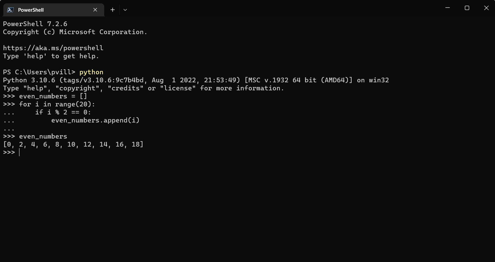

# Listas

Ahora seguimos revisando los fundamentos de Python. En esta ocasión veremos las listas.

Una lista es una colección ordenada y modificable de datos. Es decir, es mutable. Permite miembros duplicados. Además, una lista puede ser vacía y los datos que la componen pueden ser de distintos tipos.

## Sintaxis 

Para crear una lista, se usa la siguiente sintaxis:

Usado la palabra reservada *list()*:

```
lst = list()
```

También se puede crear una lista usando los corchetes cuadrados []:

```
lst = []
```

Algunos ejemplos de listas puedes ser:

```
>>> squares = [1, 4, 9, 16, 25]
>>> squares
[1, 4, 9, 16, 25]
```

```
fruits = ['banana', 'orange', 'mango', 'lemon']
vegetables = ['Tomato', 'Potato', 'Cabbage','Onion', 'Carrot']
animal_products = ['milk', 'meat', 'butter', 'yoghurt']
web_techs = ['HTML', 'CSS', 'JS', 'React','Redux', 'Node', 'MongDB']
countries = ['Finland', 'Estonia', 'Denmark', 'Sweden', 'Norway']
```

Como hemos visto en oportunidades previas, se puede usar la función *len* para revisar la cantidad de datos dentro de la lista.

```
>>> fruits = ['banana', 'orange', 'mango', 'lemon']
>>> print(len(fruits))
4
```

Ten claro que la función *len* devuelve la cantidad de elementos que tiene la lista, y no la cantidad de caracteres como pasaba en el caso de los strings.

Como se dijo, las listas pueden tener datos de distintos tipos:

```
lst = ['Paulo', 300, True, {'country':'Finland', 'city':'Helsinki'}]
```

Las listas pueden tener cualquier tipo de dato, incluso listas. A eso se llama listas anidadas o listas dentro de listas. 

```
>>> a = ['a', 'b', 'c']
>>> n = [1, 2, 3]
>>> x = [a, n]
>>> x
[['a', 'b', 'c'], [1, 2, 3]]
>>> x[0]
['a', 'b', 'c']
>>> x[0][1]
'b'
```

Otra csa interesante que podemos hacer en Python, es pasar un texto (string) a una lista, separando sus caracteres y creando una lista con ellos.

Veamos este ejemplo:

```> list('Python')
['P', 'y', 't', 'h', 'o', 'n']
```


## Indexación

Ya sabemos que en Python el índice parte en 0 (cero) para identificar el primer elemento. En las listas pasa lo mismo, el primer elemento de la lista tiene un índice 0; el segundo, indice 1; el tercero, índice 2 y así.

Para acceder a un elemento de una lista usando su índice, lo hacemos de la siguiente forma:

```
>>> fruits = ['banana', 'orange', 'mango', 'lemon']
>>> first_fruit = fruits[0]
>>> first_fruit
'banana'
>>> second_fruit = fruits[1]
>>> second_fruit
'orange'
```

También podemos usar el índice para acceder a los últimos elementos:

```
>>> fruits[-1]      # Último elemento
'lemon'
```

Podemos acceder al último elemento de esta otra forma:

```
>>> last_index = len(fruits) - 1
>>> last_fruit = fruits[last_index]
>>> last_fruit
'lemon'
```

Lógicamente, si le pasamos un índice que no existe, nos arrojará un error.

```
>>> fruits[-6]
Traceback (most recent call last):
  File "<stdin>", line 1, in <module>
IndexError: list index out of range
```

Veamos otro ejemplo...

```
>>> planets = ["Mercury", "Venus", "Earth", "Mars", "Jupiter", "Saturn", "Uranus", "Neptune"]
>>> print("The fourth planet is", planets[3])
The fourth planet is Mars
```

También puedes modificar valores de una lista mediante un índice. Para ello, se asigna un nuevo valor, de la misma manera que asignaría un valor de variable. Por ejemplo, podrías cambiar el nombre de Marte en la lista para usar su alias:

```
>>> planets[3] = "Red Planet"
>>> print("Mars is also known as", planets[3])
Mars is also known as Red Planet
```

### Búsqueda de un valor en una lista

Para determinar dónde se almacena un valor en una lista, se usa el método index de la lista. Este método busca el valor y devuelve el índice de ese elemento en la lista. Si no encuentra ninguna coincidencia, devuelve -1.

En el ejemplo siguiente se muestra el uso de "Jupiter" como el valor del índice:

```
>>> jupiter_index = planets.index("Jupiter")
>>> print("Jupiter is the", jupiter_index + 1, "planet from the sun")
Jupiter is the 5 planet from the sun
```


## Desempaquetado (unpacking)

El desempaquetado consiste en sacar los elementos de la lista y asignarlos a una variable.

```
>>> lst = ['item','item2','item3', 'item4', 'item5']
>>> first_fruit, second_fruit, third_fruit, *rest = lst

>>> print(first_fruit)     # banana
item
>>> print(second_fruit)    # orange
item2
>>> print(third_fruit)     # mango
item3
>>> print(rest)
['item4', 'item5']
```

Ojo que useamos un operador nuevo **rest*. Con ello agrupamos todo el resto de elementos que no se consignaron previamente.

Revisemos algunos usos de *rest:

```
# First Example
fruits = ['banana', 'orange', 'mango', 'lemon','lime','apple']
first_fruit, second_fruit, third_fruit, *rest = lst
print(first_fruit)     # banana
print(second_fruit)    # orange
print(third_fruit)     # mango
print(rest)           # ['lemon','lime','apple']

# Second Example
first, second, third,*rest, tenth = [1,2,3,4,5,6,7,8,9,10]
print(first)          # 1
print(second)         # 2
print(third)          # 3
print(rest)           # [4,5,6,7,8,9]
print(tenth)          # 10
```

## Trocear una lista (rebanadas)

Esto es obtener algunos elementos de la lista, una sección.

Para esto se usan los 2 puntos (:) para delimitar el rango o sección.

```
>>> shopping = ['Agua', 'Huevos', 'Aceite', 'Sal', 'Limón']

>>> shopping[0:3]
['Agua', 'Huevos', 'Aceite']

>>> shopping[:3]
['Agua', 'Huevos', 'Aceite']

>>> shopping[2:4]
['Aceite', 'Sal']
```

Podemos trocear la lista con índices negativos para hacer de forma inversa (desde el final).

```
>>> shopping[-1:-4:-1]
['Limón', 'Sal', 'Aceite']

>>> shopping[-1:-4:-2]
['Limón', 'Aceite']
```


Es posible extraer trozos (rebanadas) de una lista para lo cual tenemos varias aproximaciones para ello:

[:]\
Extrae la secuencia entera desde el comienzo hasta el final.
```
>>> shopping[:]
['Agua', 'Huevos', 'Aceite', 'Sal', 'Limón']
```

[start:]\
Extrae desde start hasta el final de la cadena.
```
>>> shopping[2:]
['Aceite', 'Sal', 'Limón']
```

[:end]\
Extrae desde el comienzo de la cadena hasta end menos 1.
```
>>> shopping[:2]
['Agua', 'Huevos']
```

[start:end]\
Extrae desde start hasta end menos 1.
```
>>> shopping[2:4]
['Aceite', 'Sal']
```

[start:end:step]\
Extrae desde start hasta end menos 1 haciendo saltos de tamaño step.
```
>>> shopping[1:4:2]
['Huevos', 'Sal']
```


## Invertir una lista

Esta es una función bastante útil. El invertir una lista es necesario en muchas ocasiones. Python nos ofrece 3 formas de hacerlo:

### Conservando la lista original:

Mediante troceado de listas con step negativo.
```
>>> shopping[::-1]
['Limón', 'Sal', 'Aceite', 'Huevos', 'Agua']
```

### Conservando la lista original:

Mediante la función reversed().
```
>>> list(reversed(shopping))
['Limón', 'Sal', 'Aceite', 'Huevos', 'Agua']
```

### Modificando la lista original:

Utilizando la función reverse() (nótese que es sin «d» al final).
```
>>> shopping.reverse()

>>> shopping
['Limón', 'Sal', 'Aceite', 'Huevos', 'Agua']
```


## Modificando listas

Ya hemos visto varias formas de modificar listas. Que recuerda, son estructuras mutables. Ahora veremos uun par de cosas muy útiles sobre la modificación de listas.


### Añadiendo elementos

#### Añadir al final de la lista

Con la función .append() podemos agregar un element al final de la lista:

```
>>> shopping = ['Agua', 'Huevos', 'Aceite']

>>> shopping.append('Atún')

>>> shopping
['Agua', 'Huevos', 'Aceite', 'Atún']
```


#### Desde una lista vacía

Una prinera opción es creando una lista vacía e ir agregando elemento en base a un determinado algoritmo, como un ciclo *for* por ejemplo.

Agregemos números pares del 0 al 20:




#### Añadir en cualquier posición

Ya vimos cómo agregar un elemento al final de la lista, pero podemos especificar el lugar dónde pondemos agregar un nuevo elemento. Para eso, usamos la función insert(). Fíjate que acá especificamos el índice en donde queremos insertar el elemento. Recuerda que la indexación parte en 0.\
El índice que especificamos en la función insert() lo podemos intepretar como la posición delante (a la izquierda) de la cual vamos a colocar el nuevo valor en la lista.

```
>>> shopping = ['Agua', 'Huevos', 'Aceite']

>>> shopping.insert(1, 'Jamón')

>>> shopping
['Agua', 'Jamón', 'Huevos', 'Aceite']

>>> shopping.insert(3, 'Queso')

>>> shopping
['Agua', 'Jamón', 'Huevos', 'Queso', 'Aceite']
```

Si por algún motivo especificamos un índice que no está dentro de la lista, el intérprete de Python no nos arrojará un error, sino que se ajustará al más cercano.

```
>>> shopping = ['Agua', 'Huevos', 'Aceite']

>>> shopping.insert(100, 'Mermelada')

>>> shopping
['Agua', 'Huevos', 'Aceite', 'Mermelada']

>>> shopping.insert(-100, 'Arroz')

>>> shopping
['Arroz', 'Agua', 'Huevos', 'Aceite', 'Mermelada']
```

Ojo con ésto! Si bien podemos agregar un elemento al final de la lista usando este método del índice, es recomendable usar append() por su legibilidad.


#### Repetir elementos

```
>>> shopping = ['Agua', 'Huevos', 'Aceite']
>>> shopping * 3
['Agua', 'Huevos', 'Aceite', 'Agua', 'Huevos', 'Aceite', 'Agua', 'Huevos', 'Aceite']
```

#### Combinar listas

Conservando la lista original\
Mediante el operador + o +=

```
>>> shopping = ['Agua', 'Huevos', 'Aceite']
fruitshop = ['Naranja', 'Manzana', 'Piña']

>>> shopping + fruitshop
['Agua', 'Huevos', 'Aceite', 'Naranja', 'Manzana', 'Piña']

>>> shopping += ['Pan', 'Tomate']
>>> shopping
['Agua', 'Huevos', 'Aceite', 'Pan', 'Tomate']
```

Modificando la lista original:\
Mediante la función extend()

```
>>> shopping = ['Agua', 'Huevos', 'Aceite']
fruitshop = ['Naranja', 'Manzana', 'Piña']

>>> shopping.extend(fruitshop)

>>> shopping
['Agua', 'Huevos', 'Aceite', 'Naranja', 'Manzana', 'Piña']
```

Si le pasamos un solo elemento usando extend(), nos dará un resultado extraño:

```
>>> shopping = ['Agua', 'Huevos', 'Aceite']

>>> shopping.extend('Limón')

>>> shopping
['Agua', 'Huevos', 'Aceite', 'L', 'i', 'm', 'ó', 'n']
```

Si usamos append() nos agragrá una lista anidada:

```
>>> shopping = ['Agua', 'Huevos', 'Aceite']

>>> fruitshop = ['Naranja', 'Manzana', 'Piña']

>>> shopping.append(fruitshop)

>>> shopping
['Agua', 'Huevos', 'Aceite', ['Naranja', 'Manzana', 'Piña']]
```

#### Reemplazar un elemento

```
>>> shopping = ['Agua', 'Huevos', 'Aceite']

>>> shopping[0]
'Agua'

>>> shopping[0] = 'Jugo'

>>> shopping
['Jugo', 'Huevos', 'Aceite']
```

Si pasamos un índice no válido, nos arrojará un error:

```
>>> shopping[100] = 'Chocolate'
Traceback (most recent call last):
  File "<stdin>", line 1, in <module>
IndexError: list assignment index out of range
```

#### Usando troceado

```
>>> shopping = ['Agua', 'Huevos', 'Aceite', 'Sal', 'Limón']

>>> shopping[1:4]
['Huevos', 'Aceite', 'Sal']

>>> shopping[1:4] = ['Atún', 'Pasta']

>>> shopping
['Agua', 'Atún', 'Pasta', 'Limón']
```

La lista que asignamos no necesariamente debe tener la misma longitud que el trozo que sustituimos.


### Remover elementos

#### Por su índice
```
>>> shopping = ['Agua', 'Huevos', 'Aceite', 'Sal', 'Limón']

>>> del(shopping[3])

>>> shopping
['Agua', 'Huevos', 'Aceite', 'Limón']
```

#### Por su valor
```
>>> shopping = ['Agua', 'Huevos', 'Aceite', 'Sal', 'Limón']

>>> shopping.remove('Sal')

>>> shopping
['Agua', 'Huevos', 'Aceite', 'Limón']
```

Si existen valores duplicados, la función remove() sólo borrará la primera ocurrencia.

```
>>> shopping = ['Agua', 'Huevos', 'Aceite', 'Sal', 'Limón', 'sal']
>>> shopping.remove('Sal')
>>> shopping
['Agua', 'Huevos', 'Aceite', 'Limón', 'sal']
```

#### Por su índice (con extracción)

Las dos funciones anteriores del() y remove() efectivamente borran el elemento indicado de la lista, pero no «devuelven» nada. Sin embargo, Python nos ofrece la función *pop()* que además de borrar, nos «recupera» el elemento; algo así como una extracción. Lo podemos ver como una combinación de acceso + borrado.

Veamos un ejemplo:

```
>>> shopping = ['Agua', 'Huevos', 'Aceite', 'Sal', 'Limón']

>>> shopping.pop()
'Limón'

>>> shopping
['Agua', 'Huevos', 'Aceite', 'Sal']

>>> shopping.pop(2)
'Aceite'

>>> shopping
['Agua', 'Huevos', 'Sal']
```

La función pop() extrae el último elemento de la lista.\
Si le especificamos un índice, podemos modificar ese comportamiento por defecto.

#### Por su rango

```
>>> shopping = ['Agua', 'Huevos', 'Aceite', 'Sal', 'Limón']

>>> shopping[1:4] = []

>>> shopping
['Agua', 'Limón']
```

#### Borrado completo de la lista

Ya hemos visto como borrar elementos determinados, pero podemos borrar la lista completa.

```
>>> shopping = ['Agua', 'Huevos', 'Aceite', 'Sal', 'Limón']

>>> shopping.clear()

>>> shopping
[]
```
```
>>> shopping = ['Agua', 'Huevos', 'Aceite', 'Sal', 'Limón']

>>> shopping = []  # Nueva zona de memoria

>>> shopping
[]
```

Ambas formas borran la lista, pero tienen diferencia en cuanto a la gestión de la memoria y, por tanto, en el rendimiento. Eso es puede ser importante en la medida del tamaño de la lista o de la velocidad ue se ejecutan las funciones. El usal clear() borra los elementos de la lista, pero mantiene el espacio asignado previamente. Al usar [], se borra y se asigna un nuevo espacio en la memoria. 


### Encontrar un elemento

Podemos encontrar un elemento específico dentro de una lista.

Para ello, podemos usar:
```
>>> shopping = ['Agua', 'Huevos', 'Aceite', 'Sal', 'Limón']

>>> shopping.index('Huevos')
1
```

Esta forma nos devuelve el índice del elemento.\
Si buscamos un valor que existe más de una vez en una lista, la función index() sólo nos devolverá el índice de la primera ocurrencia.

Si le pasamos un elemento que no está en la lista, Python nos arrojará un error.


### Pertenencia de un elemento

Podemos averiguar si un elemento está o no dentro de una lista. Esto nos devuelve un booleano (True / False). Para ello usamos el operador *in*.
```
>>> shopping = ['Agua', 'Huevos', 'Aceite', 'Sal', 'Limón']

>>> 'Aceite' in shopping
True

>>> 'Pollo' in shopping
False
```

#### Número de ocurrencias

Saber cuántas veces aparece un elemento en la lista.

```
>>> sheldon_greeting = ['Penny', 'Penny', 'Penny']

>>> sheldon_greeting.count('Howard')
0

>>> sheldon_greeting.count('Penny')
3
```

#### Ordenando una lista

Para ordenar las listas podemos utilizar el método sort() o las funciones integradas sorted(). El método sort() reordena los elementos de la lista en orden ascendente y modifica la lista original. Si un argumento del método sort() con reverse = True, ordenará la lista en orden descendente.

```
>>> shopping = ['Agua', 'Huevos', 'Aceite', 'Sal', 'Limón']

>>> sorted(shopping)
['Aceite', 'Agua', 'Huevos', 'Limón', 'Sal']
```

Fíjate que en este caso se ordena de forma ascendente por orden alfabético. En este caso, la lista original **no se modifica**.

Podemos usar sort():

```
>>> shopping = ['Agua', 'Huevos', 'Aceite', 'Sal', 'Limón']

>>> shopping.sort()

>>> shopping
['Aceite', 'Agua', 'Huevos', 'Limón', 'Sal']
```

sort() modifica la lista original.

```
>>> shopping = ['Agua', 'Huevos', 'Aceite', 'Sal', 'Limón']

>>> sorted(shopping, reverse=True)
['Sal', 'Limón', 'Huevos', 'Agua', 'Aceite']
```


## Iterar listas

Hemos visto una serie larga de cosas que podemos hacer con las listas. Como vemos, es una estructura muy flexible y que es de gran utilidad para muchos casos.

Una de las cosas que podemos hacer con las listas, es iterarlas. Es decir, recorrer sus elementos y ejecutar distintas acciones con ellos.

Veamos algunos...
```
>>> shopping = ['Agua', 'Huevos', 'Aceite', 'Sal', 'Limón']

>>> for product in shopping:
...     print(product)
...
Agua
Huevos
Aceite
Sal
Limón
```

Para dejar claro algo, y que aún no vemos con tanta profundidad, es que usamos este ciclo for los elementos *product*, pero podríamos haber usado cualquier otro nombre para identificar a los integrantes de la lista. Claramente, el nombre debe ser significativo para que sea legible y comprensible el código (ya hemos visto muchas veces este concepto), pero si usamos otro nombre, igual el algoritmo se ejecuta de todas formas.

```
>>> shopping = ['Agua', 'Huevos', 'Aceite', 'Sal', 'Limón']

>>> for animal in shopping:
...     print(animal)
...
Agua
Huevos
Aceite
Sal
Limón
```

También podemos iterar la lista imprimiendo el índice de los elementos:

```
>>> shopping = ['Agua', 'Huevos', 'Aceite', 'Sal', 'Limón']

>>> for i, product in enumerate(shopping):
... print(i, product)
...
0 Agua
1 Huevos
2 Aceite
3 Sal
4 Limón
```

Podemos iterar varias listas, usando zip():

```
>>> shopping = ['Agua', 'Aceite', 'Arroz']
>>> details = ['mineral natural', 'de oliva virgen', 'basmati']

>>> for product, detail in zip(shopping, details):
... print(product, detail)
...
Agua mineral natural
Aceite de oliva virgen
Arroz basmati
```
En el caso de que las listas no tengan la misma longitud, la función zip() realiza la combinación hasta que se agota la lista más corta.

Con zip() podemos crear una nueva lista al unir otras.
```
>>> shopping = ['Agua', 'Aceite', 'Arroz']
>>> details = ['mineral natural', 'de oliva virgen', 'basmati']

>>> list(zip(shopping, details))
[('Agua', 'mineral natural'),
 ('Aceite', 'de oliva virgen'),
 ('Arroz', 'basmati')]
```

## Copiar listas

Esto es básicamete querer generar una copia de la lista para poder modificarla, sin alterar la original. Esto es algo que muchas veces es necesario hacer, dada la mutabilidad de las listas.

si para hacer eso creamos una nueva variable desde la lista original, si modificamos una de ellas, la otra se va a modificar de igual forma. Miremos este ejemplo:

```
>>> original_list = [4, 3, 7, 1]

>>> copy_list = original_list

>>> original_list[0] = 15

>>> original_list
[15, 3, 7, 1]

>>> copy_list
[15, 3, 7, 1]
```

Para resolver ese problema, podríamos usar la función copy():

```
>>> original_list = [4, 3, 7, 1]

>>> copy_list = original_list.copy()

>>> original_list[0] = 15

>>> original_list
[15, 3, 7, 1]

>>> copy_list
[4, 3, 7, 1]
```

En el caso de que estemos trabajando con listas que contienen elementos mutables, debemos hacer uso de la función *deepcopy()* dentro del módulo copy de la librería estándar. Para ver esto en más detalle, puedes [revisar este link](https://www.geeksforgeeks.org/copy-python-deep-copy-shallow-copy/).


## Funciones aritméticas

Suma de todos los valores: Mediante la función sum():
```
>>> data = [5, 3, 2, 8, 9, 1]
>>> sum(data)
28
```

Mínimo de todos los valores: Mediante la función min():
```
>>> data = [5, 3, 2, 8, 9, 1]
>>> min(data)
1
```

Máximo de todos los valores: Mediante la función max():
```
>>> data = [5, 3, 2, 8, 9, 1]
>>> max(data)
9
```


[**<< CAPITULO ANTERIOR**](https://github.com/paulovillarroel/aprendiendo_python/blob/main/10_zodiaco_chino/10_zodiaco_chino.md) |