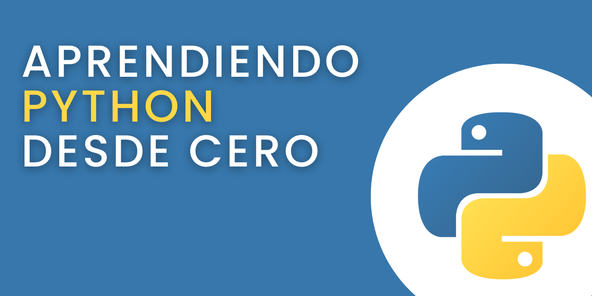

# 🐍 Aprendiendo Python

Hola!!! Bienvenido/a 😉

En este repositorio iré documentando mis estudios y aprendizajes de Python. Básicamente será como mi bloc de notas, en donde estaré publicando tips, consejos y materias relacionadas a este lenguaje. 

Trataré de hacerlo de una forma que luego sirva como material de estudio o referencia para quien quiera empezar a aprender Python o para mi mismo en un futuro.
Todavía está en total formación, así que por ahora no esperes ver mucho.

Pero...

Ya se vienen cositas.

Para mantenerte al tanto de las actualizaciones, te recomiendo que le hagas un fork a este repo, te lo clones y le marques la STAR ⭐ para darle amor al proyecto. Si no sabes de qué diablos te estoy hablando, no te preocupes. Los iré explicando más adelante. 

## Requisistos

- Tener computador e internet
- Muchas ganas de aprender
- Paciencia (en espacial si nunca has tocado una línea de código)

## ✅ Parte por aquí (Get started)

1. [Fundamentos](https://github.com/paulovillarroel/aprendiendo_python/blob/main/01_fundamentos.md)
2. [¿Qué es Python?](https://github.com/paulovillarroel/aprendiendo_python/blob/main/02_que_es_python.md)

## Contribuciones

Puedes hacer una PR o crear un [issue](https://github.com/paulovillarroel/aprendiendo_python/issues) sin problemas.

## ¿Cada cuánto tiempo subiré material?

No lo sé. Iré publicando en la medida que vaya estudiando cosas y me de el tiempo de subirlos. Así que puede ser varias veces al día o de pronto no tan seguido. Pero seguro que semana a semana va a haber nuevo material disponible. Y conociéndome, puede que haya días que me vuelva un poco loco subiendo cosas 🤣
